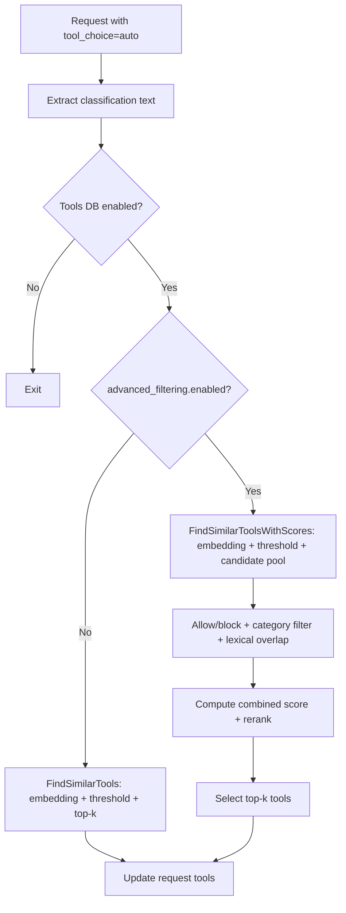

# Lọc Công Cụ Nâng Cao cho Lựa Chọn Công Cụ

Issue: [#1002](https://github.com/vllm-project/semantic-router/issues/1002)

---

## Tình Trạng Hiện Tại

Hiện tại, lựa chọn công cụ chỉ sử dụng độ tương tự embedding, ngưỡng tương tự và top-k. Khi các embeddings tương tự nhưng ý định không nhất quán, các công cụ từ các miền không chính xác có thể bị chọn.

[#1002](https://github.com/vllm-project/semantic-router/issues/1002) đề xuất nhu cầu giới thiệu các khả năng lọc công cụ nâng cao để giảm những sai lựa chọn này thông qua lọc mức độ liên quan tinh vi, đồng thời duy trì hành vi mặc định không thay đổi.

## Giải Pháp

Sau khi truy xuất tập hợp ứng cử viên embedding, thêm một **giai đoạn lọc nâng cao tùy chọn**. Giai đoạn này áp dụng lọc xác định (danh sách cho phép/chặn, lọc danh mục tùy chọn, ngưỡng trùng lặp từ vựng) và một **bộ xếp hạng lại điểm số kết hợp** kết hợp độ tương tự embedding với các tín hiệu từ vựng, thẻ, tên và danh mục. Nếu `advanced_filtering.enabled=false`, hành vi hiện tại vẫn giữ nguyên.

Lợi thế của giải pháp: duy trì độ trễ có thể kiểm soát, không giới thiệu bất kỳ phụ thuộc mô hình mới nào, và hoàn toàn có thể giải thích được thông qua cấu hình.

## Kết Quả Kiểm Tra So Sánh

Cấu hình kiểm tra:

- Tập hợp truy vấn: 20 truy vấn (17 ví dụ tích cực, 3 ví dụ tiêu cực), bao gồm các kịch bản về thời tiết, email, tìm kiếm, tính toán, lịch và các kịch bản khác
- Thư viện công cụ: 5 công cụ (get_weather, search_web, calculate, send_email, create_calendar_event)
- Lần lặp: 10
- Cấu hình lọc nâng cao: `min_lexical_overlap=1`, `min_combined_score=0.35`, `weights={embed:0.7, lexical:0.2, tag:0.05, name:0.05}`

Kết quả đánh giá:


| Chỉ Số | Đường Cơ Sở | Nâng Cao | Thay Đổi |
|--------|----------|----------|-------|
| **Độ Chính Xác** | 55.00% | 90.00% | **+35.00%** |
| **Độ Chính Xác Cao** | 78.57% | 94.12% | **+15.55%** |
| **Độ Nhạy** | 64.71% | 94.12% | **+29.41%** |
| **Tỷ Lệ Dương Tính Giả** | 100.00% | 33.33% | **-66.67%** |
| Độ Trễ Trung Bình | 0.0162 ms | 0.0197 ms | +0.0036 ms |
| Độ Trễ P95 | 0.0256 ms | 0.0288 ms | +0.0032 ms |

## Luồng Dữ Liệu



## Thay Đổi Cấu Hình

Lọc nâng cao bị vô hiệu hóa theo mặc định. Khi được bật, các trường sau sẽ có hiệu lực.

| Trường | Loại | Mặc Định | Phạm Vi / Mô Tả |
|--------|------|---------|---------------------|
| `enabled` | bool | `false` | Bật lọc nâng cao. |
| `candidate_pool_size` | int | `max(top_k*5, 20)` | Nếu được đặt và >0, sử dụng trực tiếp. |
| `min_lexical_overlap` | int | `0` | Tối thiểu trùng lặp token duy nhất giữa truy vấn và từ vựng công cụ. |
| `min_combined_score` | float | `0.0` | Ngưỡng điểm số kết hợp, phạm vi [0.0, 1.0]. |
| `weights.embed` | float | `1.0` | Nếu không đặt trọng số, embed mặc định là 1.0. |
| `weights.lexical` | float | `0.0` | Trọng số tùy chọn, phạm vi [0.0, 1.0]. |
| `weights.tag` | float | `0.0` | Trọng số tùy chọn, phạm vi [0.0, 1.0]. |
| `weights.name` | float | `0.0` | Trọng số tùy chọn, phạm vi [0.0, 1.0]. |
| `weights.category` | float | `0.0` | Trọng số tùy chọn, phạm vi [0.0, 1.0]. |
| `use_category_filter` | bool | `false` | Nếu true, lọc theo danh mục khi mức độ tin cậy đủ. |
| `category_confidence_threshold` | float | `nil` | Nếu được đặt, lọc danh mục chỉ áp dụng khi độ tin cậy quyết định ≥ ngưỡng. |
| `allow_tools` | []string | `[]` | Danh sách trắng tên công cụ; khi không trống, chỉ những công cụ này được giữ lại. |
| `block_tools` | []string | `[]` | Danh sách đen tên công cụ. |

## Triển Khai Đánh Điểm và Lọc

### Phân Từ

Quy tắc phân từ: chuyển đổi thành chữ thường và tách tại các ký tự không phải chữ và số. Chỉ các chữ cái Unicode và số được tính là token.
Triển Khai: [src/semantic-router/pkg/tools/relevance.go#L240](https://github.com/samzong/semantic-router/blob/feat/advanced-tool-filtering/src/semantic-router/pkg/tools/relevance.go#L240).

### Trùng Lặp Từ Vựng

Trùng lặp từ vựng đếm giao điểm của các **token duy nhất** sau:

- Tên công cụ
- Mô tả công cụ
- Danh mục công cụ

Thẻ không được bao gồm. Thẻ là một tín hiệu riêng biệt.

### Công Thức Điểm Số Kết Hợp

Đối với mỗi công cụ ứng cử viên:

```
combined = (w_embed * embed + w_lexical * lexical + w_tag * tag + w_name * name + w_category * category) / (w_embed + w_lexical + w_tag + w_name + w_category)
```

- `embed` là điểm số tương tự, bị giới hạn trong [0,1].
- `lexical` và `tag` là điểm số trùng lặp, chuẩn hóa theo số lượng token truy vấn / số lượng token thẻ.
- `name` và `category` là điểm số nhị phân (0 hoặc 1).
- Nếu không đặt trọng số, embed mặc định là 1.0.
- Nếu tất cả trọng số được đặt thành 0, điểm số kết hợp là 0; khi `min_combined_score > 0`, tất cả ứng cử viên sẽ bị lọc.

### Gating Độ Tin Cậy Danh Mục

Lọc danh mục chỉ có hiệu lực khi tất cả các điều kiện sau được đáp ứng:

- `use_category_filter` là true,
- Một danh mục tồn tại, và
- Độ tin cậy quyết định ≥ `category_confidence_threshold` (nếu được đặt).

## Xử Lý Lỗi và Fallback

- Khi lựa chọn công cụ không thành công và `tools.fallback_to_empty=true`: yêu cầu tiếp tục mà **không có công cụ** và một cảnh báo được ghi lại.
- Nếu `fallback_to_empty=false`: yêu cầu trả về lỗi phân loại.
- Các giá trị cấu hình nâng cao không hợp lệ bị từ chối trong quá trình tải cấu hình (xác thực phạm vi trong `validator.go`).

## Thay Đổi API

Các API và chữ ký mới hoặc đã cải đổi:

```go
// src/semantic-router/pkg/tools/tools.go
func (db *ToolsDatabase) FindSimilarToolsWithScores(query string, topK int) ([]ToolSimilarity, error)

// src/semantic-router/pkg/tools/relevance.go
func FilterAndRankTools(query string, candidates []ToolSimilarity, topK int, advanced *config.AdvancedToolFilteringConfig, selectedCategory string) []openai.ChatCompletionToolParam
```
