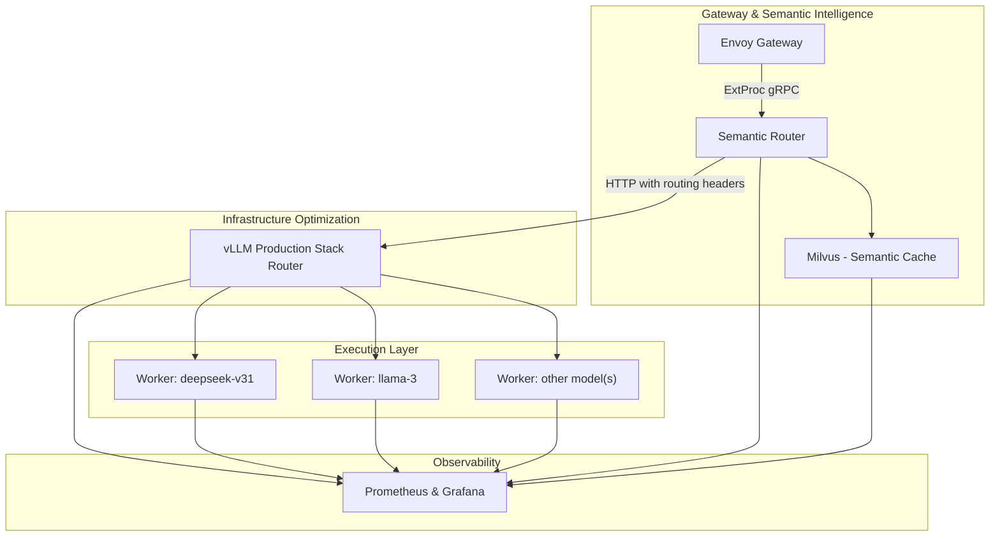
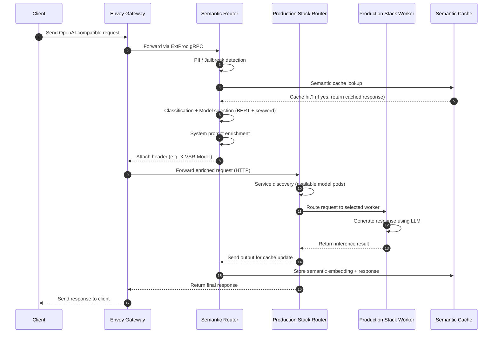

# Lớp Semantic Intelligence cho vLLM Production Stack

## 1. Tổng quan

Mục đích của tài liệu này là nêu ra một chiến lược tích hợp toàn diện giữa **vLLM Semantic Router** và **vLLM Production Stack**. vLLM Production Stack là một hệ thống tham chiếu tương thích với đám mây để triển khai vLLM ở quy mô lớn. Nó cung cấp nhiều cách triển khai khác nhau để kích hoạt các máy chủ vLLM, một bộ định tuyến yêu cầu và một ngăn xếp khả năng quan sát. Bộ định tuyến yêu cầu có thể hướng lưu lượng đến các mô hình khác nhau, thực hiện khám phá dịch vụ và khả năng chịu lỗi thông qua API Kubernetes, đồng thời hỗ trợ định tuyến round-robin, dựa trên phiên, nhận biết tiền tố, nhận biết KV-cache và prefill không tổng hợp với hỗ trợ LMCache tự nhiên. Semantic Router thêm một **lớp system-intelligence** phân loại từng yêu cầu người dùng, chọn mô hình phù hợp nhất từ một nhóm, tiêm các system prompt cụ thể về miền, thực hiện lưu trữ semantic và thực thi các kiểm tra bảo mật cấp doanh nghiệp như phát hiện PII và jailbreak.

Bằng cách kết hợp hai hệ thống này, chúng tôi có được một ngăn xếp suy luận thống nhất. Định tuyến semantic đảm bảo rằng mỗi yêu cầu được trả lời bởi mô hình tốt nhất có thể. Định tuyến Production Stack tối đa hóa hiệu quả cơ sở hạ tầng và suy luận, và hiển thị các chỉ số phong phú. Cùng nhau, họ cung cấp:

* **Trí tuệ hệ thống** — hiểu ý định của người dùng, chọn mô hình phù hợp, tiêm các system prompt thích hợp và lọc trước công cụ.
* **Hiệu quả cơ sở hạ tầng** — mở rộng từ một phiên bản duy nhất đến triển khai vLLM phân tán mà không cần thay đổi mã ứng dụng, định tuyến lưu lượng qua nhiều mô hình với tối ưu hóa cấp token và hỗ trợ LMCache tự nhiên.
* **Bảo mật và tuân thủ** — chặn PII và prompt jailbreak trước khi chúng đến mô hình.
* **Khả năng quan sát** — giám sát yêu cầu, độ trễ và sử dụng GPU thông qua bảng điều khiển Grafana của Production Stack và theo dõi các quyết định semantic-router.

---

## 2. Động lực: Tại sao Semantic Router cho Production Stack?

### 2.1 Khả năng Production Stack (trạng thái hiện tại)

vLLM Production Stack cung cấp các khối xây dựng cơ bản để phát hành các mô hình ngôn ngữ lớn ở quy mô:

| Khả năng | Mô tả |
| --- | --- |
| **Distributed deployment** | Triển khai nhiều phiên bản vLLM với hỗ trợ LMCache tự nhiên và mở rộng từ cluster một phiên bản duy nhất đến cluster nhiều phiên bản mà không cần thay đổi mã ứng dụng. |
| **Request router** | Định tuyến yêu cầu đến các mô hình khác nhau và các phiên bản, hỗ trợ các loại logic định tuyến khác nhau bao gồm disaggregated-prefill, KVCache-aware, prefix-aware, session và round-robin dựa trên định tuyến. |
| **Service discovery & fault tolerance** | Sử dụng API Kubernetes để khám phá tự động và loại bỏ các nút bị lỗi khỏi nhóm. |
| **Observability** | Cung cấp bảng điều khiển Grafana để hiển thị phân phối độ trễ, time-to-first-token, số lượng yêu cầu đang chạy hoặc đang chờ xử lý và sử dụng KV-cache GPU. |
| **Deployment simplicity** | Helm charts/CRD/Inference-gateway để cài đặt ngăn xếp và hiển thị OpenAI-compatible API. |

---

Những tính năng này tối ưu hóa sử dụng cơ sở hạ tầng nhưng hoạt động ở mức độ định tuyến tokens và yêu cầu, không phải ý nghĩa của yêu cầu. Bộ định tuyến không biết về độ phức tạp hoặc miền của tác vụ và không quyết định mô hình nào sẽ xử lý một prompt nhất định ngoài các ID mô hình được chỉ định đơn giản bởi người dùng.

### 2.2 Khả năng Semantic Router (lớp system-intelligence)

Semantic Router thêm trí tuệ cấp hệ thống trên vLLM:

| Khả năng | Mô tả |
| --- | --- |
| **Mixture-of-Models routing** | Phân loại từng yêu cầu OpenAI API sắp tới và chọn mô hình phù hợp nhất dựa trên độ phức tạp của tác vụ và miền. Điều này cải thiện độ chính xác bằng cách định tuyến các tác vụ sang các mô hình chuyên dụng thay vì một mô hình tổng quát duy nhất. |
| **Automatic tool selection** | Xác định công cụ bên ngoài nào liên quan đến prompt và giảm các lệnh gọi công cụ không cần thiết. |
| **Category-specific system prompts** | Tiêm các system prompt chuyên dụng (toán, mã hóa, kinh doanh, v.v.) dựa trên phân loại truy vấn để cải thiện lập luận và hiệu quả token. |
| **Security filters** | Phát hiện PII và chặn prompt chứa dữ liệu nhạy cảm; xác định prompt jailbreak và ngăn chúng khỏi được gửi đến LLM. |
| **Similarity caching** | Sử dụng các embedding để lưu dạo semantic representation của prompt; nếu một prompt mới tương tự như một prompt trước, phản hồi được lưu trong bộ nhớ cache có thể được trả về ngay lập tức. |
| **Distributed tracing** | Phát ra các dấu vết OpenTelemetry bao gồm phân loại, kiểm tra bảo mật, lưu trữ và các quyết định định tuyến. |

---

Những khả năng này cho phép *suy luận nhận thức về tác vụ* thích ứng với độ sâu lập luận và lựa chọn mô hình trên cơ sở từng yêu cầu. Tuy nhiên, Semantic Router không quản lý tài nguyên GPU hoặc KV-cache và hoạt động tốt nhất khi kết hợp với một ngăn xếp phục vụ có khả năng mở rộng.

### 2.3 Phân tích Phân biệt: Những Điểm Mạnh Bổ sung

Hai hệ thống nhắm vào các lớp khác nhau của ngăn xếp suy luận:

#### Semantic Router – Lớp Request Intelligence

* Hiểu ý định của người dùng thông qua phân loại tín hiệu đa, kết hợp đối sánh từ khóa, tương tự embedding và phân loại dựa trên LLM.
* Chọn mô hình hoạt động tốt nhất và các công cụ tùy chọn dựa trên điểm số cụ thể về miền.
* Làm phong phú yêu cầu bằng cách tiêm các system prompt và thêm các tiêu đề siêu dữ liệu định tuyến.
* Thực hiện lọc bảo mật (phát hiện PII và jailbreak) và lưu trữ semantic.

#### Production Stack – Lớp Tối ưu hóa Cơ sở hạ tầng

* Cải thiện hiệu quả suy luận với hỗ trợ LMCache tự nhiên bằng cách sử dụng round-robin, định tuyến dựa trên phiên, nhận biết tiền tố, KVCache-aware và disaggregated-prefill routing.
* Unload KV-cache sang bộ nhớ CPU và lưu trữ từ xa (qua LMCache) và hỗ trợ các chiến lược định tuyến nhận biết KV-cache.
* Mở rộng ngang qua Kubernetes và hiển thị các chỉ số và dấu vết để giám sát.

Sự chồng chéo giữa các lớp này là tối thiểu. Semantic Router đưa ra quyết định dựa trên *cái gì* người dùng đang yêu cầu, trong khi Production Stack tối ưu hóa *cách thức* yêu cầu được thực thi. Do đó, tích hợp kết hợp trí tuệ semantic với hiệu quả cấp GPU.

### 2.4 Tại sao tích hợp quan trọng: Đạt được Trí tuệ Cấp hệ thống

Nếu không có trí tuệ semantic, Production Stack xử lý tất cả các yêu cầu như nhau: các prompt đơn giản sử dụng cùng các mô hình lớn và độ sâu lập luận như các tác vụ phức tạp, dẫn đến chi phí không cần thiết và độ trễ. Nếu không có tối ưu hóa cấp cơ sở hạ tầng, Semantic Router không thể mở rộng quy mô đến khối lượng công việc QPS cao hoặc quản lý KV-cache một cách hiệu quả. Bằng cách tích hợp chúng:

* Các truy vấn đơn giản (ví dụ: các câu hỏi về sự kiện) có thể được định tuyến đến các mô hình nhỏ hơn, rẻ hơn với lập luận tối thiểu, trong khi các tác vụ phức tạp sử dụng các mô hình lớn hơn và lập luận chain-of-thought.
* Lựa chọn mô hình của Semantic Router lọc nhóm công nhân chỉ những công nhân phục vụ mô hình được chọn; bộ định tuyến Production Stack sau đó chọn công nhân có sự chồng chéo KV-cache cao nhất hoặc tải ít nhất.
* Lưu trữ lớp kép (semantic cache + KV-cache) cho phép hệ thống hoặc phục vụ phản hồi ngay lập tức từ bộ nhớ cache hoặc sử dụng lại các tiền tố cấp token để giảm chi phí prefill.
* Dấu vết end-to-end cung cấp khả năng hiển thị cho các quyết định semantic và cơ sở hạ tầng, cho phép tối ưu hóa liên tục.

---

## 3 Mục tiêu và Không phải mục tiêu

### 3.1 Mục tiêu

Các mục tiêu chính của tích hợp:

1. **Seamless integration** – Semantic Router chạy như một lớp xử lý trước bộ định tuyến Production Stack. Yêu cầu chảy từ cổng vào Semantic Router, sau đó đến bộ định tuyến Production Stack, và cuối cùng đến công nhân vLLM thích hợp.
2. **Dual-layer caching** – Kết hợp lưu trữ semantic (cấp yêu cầu) với sử dụng lại KV-cache (cấp token) sao cho các prompt chính xác hoặc tương tự tránh suy luận đầy đủ và các overlap một phần giảm thiểu chi phí prefill.
3. **Model-aware routing** – Bộ định tuyến Production Stack lọc công nhân theo mô hình được chọn bởi Semantic Router. Chọn công nhân tối ưu dựa trên logic định tuyến khác nhau để tối đa hóa cache hits.
4. **Security enforcement** – Chặn prompt chứa PII hoặc mẫu jailbreak trước khi chúng đến mô hình.
5. **Unified observability** – Theo dõi các quyết định semantic và định tuyến cơ sở hạ tầng trong một span duy nhất bằng OpenTelemetry và giám sát các chỉ số hệ thống qua Grafana.
6. **Zero-downtime updates** – Các quy tắc định tuyến của Semantic Router và điểm số mô hình có thể được hot-reloaded mà không cần khởi động lại Production Stack. Cấu hình động của bộ định tuyến sản xuất cho phép cập nhật trực tiếp để khám phá dịch vụ và logic định tuyến.

### 3.2 Không phải mục tiêu

1. **Replacing the Production-Stack router** – Semantic Router tăng cường bộ định tuyến hiện có; nó không tiếp quản định tuyến cơ sở hạ tầng. Nếu Semantic Router không thành công, bộ định tuyến Production Stack tiếp tục hoạt động bằng cách sử dụng định tuyến mô hình mặc định.
2. **Modifying vLLM or Production-Stack core** – Tích hợp sử dụng các API tiêu chuẩn (ExtProc gRPC cho Envoy hoặc tiêm tiêu đề HTTP) và không yêu cầu các thay đổi đối với nội bộ vLLM.
3. **Unified configuration** – Giữ cấu hình của các chính sách semantic tách biệt khỏi cài đặt cơ sở hạ tầng để cho phép tiến hóa độc lập.
4. **Synchronous coupling** – Cả hai hệ thống có thể chạy độc lập nếu một hệ thống không khả dụng; các đường dẫn fallback đảm bảo suy thoái duyên.

---

## 4 Chi tiết Đề xuất

### 4.1 Nguyên tắc thiết kế

1. **Separation of concerns** – Giữ trí tuệ semantic không liên quan đến tối ưu hóa cơ sở hạ tầng. Semantic Router tập trung vào việc hiểu và làm phong phú yêu cầu, trong khi bộ định tuyến Production Stack xử lý lựa chọn công nhân và lập lịch.
2. **API-driven integration** – Sử dụng Envoy's external processing (ExtProc) gRPC API hoặc tiêm tiêu đề HTTP để tích hợp Semantic Router với cổng vào và bộ định tuyến Production Stack. Điều này tránh sửa đổi nội bộ của một trong hai hệ thống.
3. **Fail-safe design** – Nếu Semantic Router không khả dụng hoặc trả về lỗi, cổng vào chuyển tiếp yêu cầu ban đầu đến bộ định tuyến Production Stack (bỏ qua xử lý semantic). Bộ định tuyến Production Stack mặc định cho mô hình được chỉ định bởi người dùng hoặc logic round-robin.
4. **Kubernetes-native** – Tận dụng Helm charts/CRD cho các triển khai có thể tái tạo.

### 4.2 System Architecture

Hệ thống tích hợp bao gồm bốn lớp:

#### System Architecture

1. **Gateway & Semantic Intelligence**
   * **Envoy Gateway** — Nhận các yêu cầu OpenAI-compatible API và chuyển tiếp chúng qua ExtProc gRPC đến Semantic Router. Hoạt động như điểm nhập unified.
   * **Semantic Router Service** — Một dịch vụ gRPC không trạng thái chạy nhiều bản sao để có tính khả dụng cao. Nó thực hiện phân loại, lọc bảo mật, tìm kiếm semantic cache, lựa chọn mô hình và công cụ, và làm phong phú yêu cầu.
   * **Milvus Service** — Một cơ sở dữ liệu vector được sử dụng để lưu trữ semantic; lưu trữ các embedding và phản hồi với TTL có thể cấu hình.
   * **ConfigMap & Model PVCs** — Giữ các quy tắc định tuyến, định nghĩa danh mục và các trọng lượng mô hình được tải xuống.

2. **Infrastructure Optimization (Production Stack)**
   * **vLLM-router Service** — Dịch vụ Production Stack hiện có chịu trách nhiệm về khám phá dịch vụ, cân bằng tải và KV-cache aware/disaggregated-prefill routing. Nó phân tích trường `model` được tiêm bởi Semantic Router và lọc công nhân phục vụ mô hình đó.
   * **LMCache / KV-Cache Manager** — Tùy chọn unload KV-cache sang lưu trữ từ xa và hiển thị các chỉ số cho cache hits.
   * **Prometheus & Grafana** — Thu thập và hiển thị các chỉ số như độ trễ yêu cầu, TTFT và sử dụng KV-cache GPU.

3. **Execution (vLLM Workers)**
   * **Model Pools** — StatefulSets riêng biệt cho mỗi mô hình (ví dụ: llama-3 chat, deepseek-v31, qwen3) với các dịch vụ headless. Mỗi công nhân chạy vLLM với lưu trữ prefix-aware hoặc KV-aware và tạo phản hồi.
   * **Dynamic Scaling** — Horizontal Pod Autoscaler hoặc KEDA mở rộng các bản sao công nhân dựa trên QPS và sử dụng GPU.

4. **Storage Layer**
   * **Semantic Cache Storage** — Milvus sử dụng các volume bền vững cho các embedding và phản hồi.
   * **KV-cache Storage** — Bộ nhớ GPU cho bộ nhớ cache nóng; bộ nhớ hệ thống hoặc NVMe cho bộ nhớ cache ấm/lạnh. LMCache có thể unload và chia sẻ KV-cache qua các phiên bản với phân cấp lưu trữ nhiều tầng.

### 4.3 Request Flow

#### 4.3.1 End-to-End Request Processing

1. **Client request** — Máy khách gửi một yêu cầu OpenAI-compatible (ví dụ: `/v1/chat/completions`) đến cổng vào chỉ định `model:"auto"`.
2. **Envoy intercepts request** — Envoy nhận yêu cầu HTTP và gọi Semantic Router qua ExtProc gRPC, chuyển qua nội dung yêu cầu và tiêu đề.
3. **Semantic Router processing** — Semantic Router thực thi pipeline sau:
   * **Security filtering** — Chạy phát hiện PII và jailbreak; chặn hoặc làm mờ prompt nếu xác suất vượt quá ngưỡng.
   * **Semantic cache lookup** — Tạo embedding MiniLM và tìm kiếm Milvus cho các truy vấn tương tự. Khi hit, trả về phản hồi được lưu trong bộ nhớ cache ngay lập tức.
   * **Multi-signal classification** — Áp dụng đối sánh từ khóa (con đường nhanh), tương tự embedding (tìm kiếm khái niệm) và phân loại ModernBERT. Chọn tín hiệu có độ tin cậy cao nhất và gán một danh mục.
   * **Model & tool selection** — Tra cứu điểm số mô hình cho danh mục và chọn mô hình tốt nhất. Chọn các công cụ liên quan và chế độ lập luận (bật/tắt) dựa trên truy vấn.
   * **Request enrichment** — Tiêm các system prompt, cập nhật trường `model` thành mô hình được chọn, thêm tiêu đề định tuyến (ví dụ: `X-VSR-Category`, `X-VSR-Model`, `X-VSR-Reasoning`) và chuyển tiếp đến Envoy.
4. **Envoy forwards enriched request** — Envoy chuyển tiếp yêu cầu être enriched đến bộ định tuyến Production Stack (dịch vụ vllm-router). Bộ định tuyến không biết về các sửa đổi semantic và xử lý nó như một yêu cầu bình thường cho mô hình được chỉ định.
5. **Production-Stack routing** — vLLM-router thực hiện khám phá dịch vụ và lọc nhóm công nhân phục vụ mô hình được chọn. Nó sử dụng round-robin, dựa trên phiên hoặc các thuật toán prefix/KV-aware để chọn công nhân có sự chồng chéo cache cao nhất hoặc tải ít nhất.
6. **vLLM worker execution** — Công nhân vLLM được chọn nhận yêu cầu chứa system prompt được tiêm và thực thi suy luận. Lưu trữ tiền tố và sử dụng lại KV-cache giảm thời gian prefill.
7. **Semantic cache update** — Khi công nhân trả về phản hồi, Semantic Router lưu trữ query embedding và phản hồi trong Milvus với TTL có thể cấu hình.
8. **Client response** — Envoy trả về phản hồi cho máy khách, tùy chọn thêm tiêu đề khả năng quan sát (mô hình được chọn, danh mục, chế độ lập luận, cache hit/miss).

#### 4.3.2 Dual-Layer Caching Strategy

Tích hợp tận dụng hai lớp lưu trữ bổ sung:

* **Layer 1: Semantic Cache (request-level)** — Lưu trữ các cặp request/response hoàn chỉnh trong Milvus. Khi tương tự cosin giữa truy vấn mới và truy vấn được lưu trong bộ nhớ cache vượt quá ngưỡng (ví dụ: 0,85), phản hồi được lưu trong bộ nhớ cache được trả về mà không có suy luận nào. Điều này loại bỏ việc tạo token không cần thiết.
* **Layer 2: KV Cache (token-level)** — Được quản lý bởi bộ định tuyến Production Stack và LMCache. Định tuyến prefix-aware hoặc KV-aware đảm bảo rằng các yêu cầu có tiền tố chồng chéo được định tuyến đến cùng một công nhân nơi KV-cache cư trú. Ngay cả khi semantic cache miss, sử dụng lại KV-cache giảm thời gian prefill và cải thiện throughput.

Kết hợp, những bộ nhớ cache này cung cấp ba kịch bản:

| Kịch bản | Semantic Cache | KV Cache | Kết quả |
| --- | --- | --- | --- |
| **Exact semantic match** | Hit | N/A | Trả về phản hồi được lưu trong bộ nhớ cache ngay lập tức (không suy luận)|
| **Partial match / overlap** | Miss | Hit | Thực hiện suy luận nhưng sử dụng lại KV-cache; giảm độ trễ|
| **Novel query** | Miss | Miss | Suy luận đầy đủ; phân loại và định tuyến công nhân xảy ra bình thường|

### 4.4 Tích hợp trong Kubernetes

#### 4.4.1 Deployment Architecture

Tích hợp theo dõi một kiến trúc dịch vụ nhiều lớp trong Kubernetes (xem sơ đồ dưới đây để thấy bố cục khái niệm):

1. **Envoy Gateway & Semantic Router**
   * `gateway-svc` — Hiển thị `/v1/*` API trên cổng 8080. Được cấu hình với bộ lọc ExtProc chuyển tiếp các yêu cầu đến `semantic-router-svc`.
   * `semantic-router-svc` — Dịch vụ ClusterIP hiển thị gRPC trên cổng 50051. Nó triển khai nhiều pod để có tính khả dụng cao và gắn các trọng lượng mô hình qua PersistentVolumeClaims. Nó phụ thuộc vào `milvus-svc` để lưu trữ semantic và ConfigMap cho các quy tắc định tuyến.
   * `milvus-svc` — Chạy cơ sở dữ liệu vector Milvus trên cổng 19530 và lưu trữ các embedding và phản hồi.

2. **Production-Stack Router & Observability**
   * `vllm-router-svc` — Hiển thị điểm cuối HTTP của bộ định tuyến Production Stack (cổng mặc định 80). Nó nhận các yêu cầu được làm phong phú từ Envoy và thực hiện khám phá dịch vụ và lựa chọn công nhân.
   * `prometheus-svc` & `grafana-svc` — Thu thập và hiển thị các chỉ số cho độ trễ, TTFT và sử dụng KV-cache.

3. **vLLM Worker Pools**
   * `vllm-{model}-svc` — Dịch vụ headless cho mỗi mô hình (ví dụ: `llama3-chat`, `deepseek-v31`) hiển thị các pod công nhân. Các công nhân chạy vLLM.
   * Horizontal Pod Autoscalers mở rộng các bản sao công nhân dựa trên sử dụng CPU/GPU và QPS.

4. **Storage**
   * Các volume bền vững cho Milvus, các trọng lượng mô hình và LMCache (nếu được bật).

#### 4.4.2 Service Communication Flow

Trình tự sau minh họa luồng end-to-end cho yêu cầu hoàn tất trò chuyện:

1. **Client Request** – Máy khách gửi `POST /v1/chat/completions` với `model: "auto"`.
2. **Gateway** – Cổng vào (`gateway-svc`) nhận yêu cầu và chuyển tiếp nó đến `semantic-router-svc` qua ExtProc gRPC, bao gồm nội dung yêu cầu và tiêu đề.
3. **Semantic Router** – Thực hiện fusion routing: đối sánh từ khóa, tìm kiếm tương tự và phân loại ModernBERT, chọn danh mục (ví dụ: *math*), chọn mô hình tốt nhất (ví dụ: `deepseek-v31`), tiêm một system prompt toán học và đặt `X-VSR-Model: deepseek-v31`, `X-VSR-Category: math` headers. Nó cũng chạy phát hiện PII/jailbreak và tìm kiếm semantic cache; khi hit bộ nhớ cache, nó trả về phản hồi được lưu trong bộ nhớ cache.
4. **Gateway** – Nhận yêu cầu được làm phong phú. Nếu phản hồi được lưu trong bộ nhớ cache được trả về, nó bỏ qua các bước tiếp theo và trả lời trực tiếp cho máy khách. Ngoài ra, nó chuyển tiếp yêu cầu đến `vllm-router-svc` trên cổng 80.
5. **Production-Stack Router** – Phân tích trường `model` (`deepseek-v31`), lọc nhóm công nhân tương ứng và sử dụng định tuyến khác nhau để chọn công nhân có sự chồng chéo cache cao nhất. Nó chuyển tiếp yêu cầu đến pod công nhân được chọn.
6. **vLLM Worker** – Xử lý yêu cầu bằng system prompt được tiêm, sử dụng lại các khối KV-cache khi có sẵn. Công nhân truyền phát hoặc trả về phản hồi được tạo.
7. **Semantic Cache Update** – Khi nhận phản hồi, Semantic Router lưu trữ query embedding và phản hồi trong Milvus với TTL để cache hits trong tương lai.
8. **Response to Client** – Cổng vào trả về phản hồi cho máy khách, tùy chọn bao gồm tiêu đề khả năng quan sát (`X-VSR-Model-Used`, `X-VSR-Cache-Hit`, v.v.).

### 4.5 Implementation Plan (Thích ứng từ [Dynamo Proposal](https://vllm-semantic-router.com/docs/proposals/nvidia-dynamo-integration))

Tích hợp sẽ được cung cấp theo bốn giai đoạn:

#### Phase 1: Foundation

**Mục tiêu:**

* Thiết lập tích hợp cơ bản giữa Semantic Router và Production Stack
* Thực hiện ghi đè mô hình minh bạch trong nội dung yêu cầu
* Xác nhận luồng yêu cầu end-to-end

**Các nhiệm vụ:**

1. **Semantic Router Enhancements**:
   * Thực hiện sửa đổi nội dung yêu cầu: model: "auto" → "selected-model"
   * Thêm tiêm system prompt vào mảng messages
   * Thêm tiêu đề khả năng quan sát tùy chọn:
      * x-vsr-selected-category: Kết quả phân loại
      * x-vsr-selected-reasoning: Chế độ lập luận ("on" hoặc "off")
      * x-vsr-selected-model: Tên mô hình được chọn
      * x-vsr-injected-system-prompt: Trạng thái tiêm system prompt ("true" hoặc "false")
      * x-vsr-cache-hit: Trạng thái cache hit (chỉ khi hit cache)
      * Đảm bảo tương thích OpenAI API được duy trì

2. **Production Stack**:
   * PS nhận các yêu cầu OpenAI API tiêu chuẩn
   * Trường mô hình đã chứa tên mô hình được chọn
   * Không cần biết về sự liên quan của VSR
   * Logic định tuyến hiện có hoạt động như cũ

3. **Testing**:
   * Unit tests cho logic ghi đè mô hình
   * Integration tests cho tiêm system prompt
   * Xác minh PS định tuyến đến các nhóm mô hình chính xác
   * Load tests với 1K RPS

**Tiêu chí thành công**:

* ✅ Yêu cầu được định tuyến đến các nhóm mô hình chính xác dựa trên tên mô hình được ghi đè
* ✅ System prompts được tiêm chính xác vào messages
* ✅ PS hoạt động minh bạch mà không cần sửa đổi
* ✅ Overhead độ trễ < 10ms
* ✅ Không có các thay đổi phá vỡ đối với các triển khai hiện có

#### Phase 2: Observability & Monitoring

**Mục tiêu:**

* Full-stack distributed tracing qua VSR → PS → Workers
* Toàn diện metrics và dashboards
* Alerting và SLO monitoring

**Các nhiệm vụ:**

1. **Distributed Tracing (OpenTelemetry):**

   * Trace context propagation từ VSR qua PS đến workers
   * Span hierarchy:
      * Root span: Envoy Gateway
      * Child span: Semantic Router (fusion routing, cache, security)
         * Sub-span: BERT classification
         * Sub-span: Keyword matching
         * Sub-span: Similarity search
         * Sub-span: Signal fusion & decision
      * Child span: PS Frontend (routing, worker selection)
      * Child span: vLLM Worker (inference execution)
   * Automatic trace ID injection trong headers
   * Support cho Jaeger, Tempo, và các OTLP-compatible backends khác

2. **Metrics Collection:**
   * Semantic Router metrics:
     * Fusion routing performance:
       * BERT classification latency và accuracy
       * Keyword matching hit rate và latency
       * Similarity search latency
       * Signal fusion decision distribution
     * Semantic cache hit rate (Milvus)
     * PII/Jailbreak detection rate
     * Model selection distribution theo danh mục
   * PS metrics:
     * Worker utilization
     * TTFT, TPOT, ITL
     * KV cache hit rate
   * End-to-end latency breakdown theo component

3. **Dashboards:**
   * Grafana dashboard cho integrated stack
   * Request flow visualization với trace waterfall
   * Cost và performance analytics
   * Cache efficiency metrics (semantic + KV)

**Tiêu chí thành công**:

* ✅ Single distributed trace spans tất cả layers (VSR → PS → Worker)
* ✅ Minimal trace sampling overhead
* ✅ Real-time dashboards operational
* ✅ Trace context properly propagated qua service boundaries

#### Phase 4: Production Hardening

**Mục tiêu:**

* Failure handling và resilience
* Performance optimization
* Triển khai production

**Các nhiệm vụ:**

1. **Resilience:**
   * Semantic Router failure fallback đến PS
   * Circuit breaker cho cache backend
   * Graceful degradation strategies

2. **Performance:**
   * Latency optimization (target: < 50ms combined)
   * Throughput testing (target: 10K RPS)
   * Resource utilization tuning

3. **Documentation:**
   * Deployment guide
   * Configuration reference
   * Troubleshooting runbook

**Tiêu chí thành công**:

* ✅ High availability
* ✅ Low P99 latency (routing overhead)
* ✅ 10K+ RPS sustained throughput

---

## 5 Security and Privacy Considerations

### 5.1 PII Detection and Blocking

Mô hình phát hiện PII sử dụng ModernBERT để xác định các token nhạy cảm như tên, email hoặc số an sinh xã hội. Các prompt chứa PII vượt quá ngưỡng có thể cấu hình (mặc định 0,7) bị chặn hoặc làm mờ trước khi được gửi đến mô hình. Các nhà khai thác có thể chọn từ chối yêu cầu hoặc mặt nạ các token được phát hiện. Semantic Router trả về tiêu đề phản hồi cho biết PII bị chặn để kiểm tra.

### 5.2 Jailbreak Prevention (Prompt Guard)

Phát hiện jailbreak bảo vệ chống lại các cuộc tấn công tiêm prompt, ghi đè lệnh và các mẫu đối kháng khác. Một phân cấp các bộ phân loại LoRA-adapted chạy trên BERT, RoBERTa hoặc ModernBERT phát hiện các prompt như vậy. Các yêu cầu vượt quá ngưỡng được cấu hình (mặc định 0,7) bị chặn và cổng vào phản hồi với thông báo lỗi. Tiêu đề phản hồi bao gồm loại và độ tin cậy của cuộc tấn công được phát hiện. Cơ chế này bảo vệ các mô hình vLLM khỏi các hướng dẫn độc hại và đảm bảo rằng các prompt an toàn đến công cụ suy luận.

### 5.3 Data Residency and Compliance

Các embedding và phản hồi được lưu trong bộ nhớ cache trong Milvus có thể cấu thành dữ liệu cá nhân. Các triển khai nên mã hóa các volume bền vững ở trạng thái và thực thi các chính sách retenion dữ liệu thích hợp. Milvus hỗ trợ các cài đặt time-to-live (TTL) cho mỗi bộ sưu tập; các quản trị viên nên điều chỉnh các giá trị TTL để cân bằng hiệu quả bộ nhớ cache và thu gọn dữ liệu (ví dụ: mặc định 2 giờ). Đảm bảo rằng vị trí địa lý của lưu trữ tuân thủ các yêu cầu tổ chức và quy định.

---

## 6 Operational Considerations

### 6.1 Monitoring and Alerting

Các nhà khai thác nên giám sát cả các chỉ số semantic và cơ sở hạ tầng:

* **Semantic metrics** – latency phân loại, tỷ lệ phát hiện PII/jailbreak, semantic cache hit rate, độ dài hàng đợi embedding. Những điều này có thể được xuất dưới dạng các chỉ số Prometheus từ Semantic Router và được hình dung trong Grafana.
* **Infrastructure metrics** – vLLM router throughput, sử dụng CPU/GPU công nhân, KV-cache hit rate, phân phối độ trễ yêu cầu và TTFT.
* **Alerts** – Đặt cảnh báo cho latency phân loại cao, tỷ lệ cao của prompt bị chặn, semantic cache hit rate thấp, sử dụng bộ nhớ GPU tăng và độ dài hàng đợi công nhân cao.

### 6.2 Maintenance and Updates

* **Model updates** – Định kỳ retrain phân loại, PII và các mô hình phát hiện jailbreak và triển khai các cập nhật bằng cách thay thế các tệp mô hình được gắn trong các pod Semantic Router. Sử dụng blue-green hoặc canary deployments để giảm thiểu sự gián đoạn.
* **Routing rules** – Duy trì một ConfigMap chỉ định ánh xạ category→model và các chính sách công cụ. Semantic Router theo dõi ConfigMap này cho các thay đổi và tải lại các quy tắc mà không cần khởi động lại.
* **Scaling** – Điều chỉnh Horizontal Pod Autoscaler và các tham số LMCache dựa trên các mẫu tải được quan sát. Hãy xem xét kích hoạt sleep/wakeup mode trong vLLM để giảm chi phí trong các khoảng thời gian lưu lượng truy cập thấp.

### 6.3 Failure Modes and Recovery

Các kịch bản bị lỗi tiềm năng bao gồm:

1. **Semantic Router unavailable** – Yêu cầu bỏ qua Semantic Router và được chuyển tiếp trực tiếp đến bộ định tuyến Production Stack. Phản hồi có thể có độ chính xác thấp hơn hoặc chi phí cao hơn, nhưng dịch vụ vẫn hoạt động.
2. **Milvus outage** – Tìm kiếm và cập nhật semantic cache không thành công; phân loại và kiểm tra bảo mật vẫn hoạt động. Semantic cache hit rate giảm tạm thời.
3. **vLLM worker failures** – Kiểm tra sức khỏe của bộ định tuyến Production Stack loại bỏ công nhân bị lỗi. Autoscaling sinh ra công nhân mới để duy trì công suất.
4. **KV-cache exhaustion** – Khi bộ nhớ GPU đầy, các khối KV-cache có thể bị loại bỏ, giảm lợi ích của sử dụng lại tiền tố. LMCache có thể unload sang bộ nhớ hệ thống hoặc NVMe và chia sẻ bộ nhớ cache qua các công nhân; giám sát sử dụng KV GPU và mở rộng bộ nhớ hoặc giảm các yêu cầu đồng thời.

---

## 7 Future Enhancements

### 7.1 Advanced Routing Strategies

Tích hợp các tín hiệu semantic vào định tuyến cơ sở hạ tầng là một lĩnh vực thú vị cho nghiên cứu trong tương lai. Ví dụ, độ tin cậy phân loại có thể ảnh hưởng đến lựa chọn công nhân: các truy vấn entropy cao có thể ưa thích các công nhân có bộ nhớ trống hơn hoặc GPU nhanh hơn. Nghiên cứu về consistent hashing và locality-sensitive hashing có thể tiếp tục cải thiện KV-cache hit rates.

### 7.2 Cross-Layer Optimization

Tích hợp các lớp semantic và cơ sở hạ tầng mở ra những cơ hội cho các tối ưu hóa chung:

* **Semantic-aware KV-cache management** – Sử dụng thông tin danh mục để lập lịch KV-cache eviction và chia sẻ. Các miền tương tự (ví dụ: các truy vấn toán học) có thể chia sẻ các khối KV-cache qua các công nhân để cải thiện sử dụng lại.
* **Pluggable embedding and classification models** – Phục vụ các mô hình embedding và phân loại qua các công nhân vLLM để thống nhất lưu trữ mô hình. Điều này sẽ cho phép tăng tốc GPU khi tài nguyên CPU trở thành một vấn đề và đơn giản hóa quản lý mô hình.
* **Dynamic reasoning budgets** – Điều chỉnh độ sâu lập luận và kích hoạt chain-of-thought dựa trên tầm quan trọng của người dùng, ràng buộc chi phí hoặc mục tiêu cấp dịch vụ, được lấy cảm hứng từ nghiên cứu về suy luận nhận thức về tác vụ.

### 7.3 Multi-Tenant Support

Các doanh nghiệp thường yêu cầu các chính sách định tuyến được cô lập và các nhóm mô hình cho mỗi người thuê. Công việc trong tương lai bao gồm thêm ID người thuê vào các khóa semantic cache và tiêu đề bộ định tuyến, cung cấp các bộ sưu tập Milvus chuyên dụng cho mỗi người thuê và hỗ trợ các danh mục mô hình cho mỗi người thuê. Các quyền kiểm soát dựa trên vai trò sẽ đảm bảo rằng các người thuê không thể truy cập các bộ nhớ cache hoặc mô hình của nhau.

---

## 8 References

1. [vLLM Production Stack](https://github.com/vllm-project/production-stack)
2. [vLLM Semantic Router](https://github.com/vllm-project/semantic-router)
3. [Semantic Intelligence Layer for NVIDIA Dynamo](https://vllm-semantic-router.com/docs/proposals/nvidia-dynamo-integration#46-implementation-plan)
