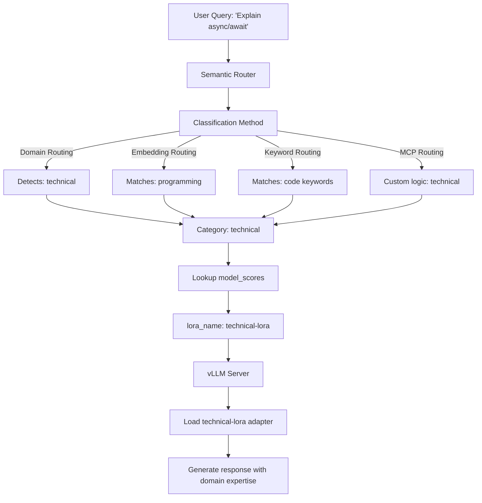

# Định tuyến LoRA Thông minh

Hướng dẫn này hướng dẫn bạn cách kết hợp định tuyến thông minh (domain/embedding/keyword/MCP) với các bộ điều chỉnh LoRA để định tuyến các yêu cầu đến các mô hình cụ thể cho miền. Định tuyến LoRA sử dụng các phương pháp phân loại từ các hướng dẫn trước đó để phát hiện ý định, sau đó tự động chọn bộ điều chỉnh LoRA thích hợp trên phần mềm nền tảng vLLM.

## Lợi ích chính

- **Lựa chọn bộ điều chỉnh nhận thức về ý định**: Kết hợp bất kỳ phương pháp phân loại nào (domain/embedding/keyword/MCP) với các bộ điều chỉnh LoRA
- **Tiết kiệm bộ nhớ**: Chia sẻ trọng số mô hình cơ sở trên nhiều bộ điều chỉnh miền (<1% tham số trên mỗi bộ điều chỉnh)
- **Minh bạch với người dùng**: Người dùng gửi yêu cầu đến một điểm cuối, router xử lý lựa chọn bộ điều chỉnh
- **Phân loại linh hoạt**: Chọn phương pháp định tuyến tốt nhất cho trường hợp sử dụng của bạn (domain để có độ chính xác, từ khóa để tuân thủ, v.v.)

## Vấn đề nó giải quyết là gì?

vLLM hỗ trợ nhiều bộ điều chỉnh LoRA, nhưng người dùng phải tự chỉ định bộ điều chỉnh nào sẽ sử dụng. Định tuyến LoRA tự động hóa điều này:

- **Lựa chọn bộ điều chỉnh thủ công**: Người dùng không biết bộ điều chỉnh nào sẽ sử dụng → Router phân loại ý định và chọn bộ điều chỉnh tự động
- **Hiệu quả bộ nhớ**: Nhiều mô hình đầy đủ không vừa với GPU → Các bộ điều chỉnh LoRA chia sẻ trọng số cơ sở (~1% chi phí trên mỗi bộ điều chỉnh)
- **Đơn giản hóa triển khai**: Quản lý nhiều điểm cuối mô hình là phức tạp → Một phiên bản vLLM phục vụ tất cả các bộ điều chỉnh
- **Phát hiện ý định**: Mô hình cơ sở chung thiếu chuyên môn về miền → Router định tuyến đến các bộ điều chỉnh chuyên biệt dựa trên nội dung truy vấn

## Khi nào sử dụng

- **Triển khai vLLM đa miền** với các bộ điều chỉnh LoRA cho các miền khác nhau (kỹ thuật, y tế, pháp lý, v.v.)
- **Lựa chọn bộ điều chỉnh tự động** nơi bạn muốn người dùng gửi yêu cầu mà không cần biết tên bộ điều chỉnh
- **Kết hợp phân loại + LoRA**: Sử dụng định tuyến miền để có độ chính xác, định tuyến từ khóa để tuân thủ hoặc MCP cho logic tùy chỉnh
- **Các tình huống bị giới hạn về bộ nhớ** nơi nhiều mô hình đầy đủ không vừa nhưng các bộ điều chỉnh LoRA có thể
- **Kiểm tra A/B** các phiên bản bộ điều chỉnh khác nhau bằng cách điều chỉnh điểm số danh mục

## Cấu hình

### Các yêu cầu

- Một máy chủ vLLM đang chạy với hỗ trợ LoRA được bật
- Các tập tin bộ điều chỉnh LoRA (tinh chỉnh cho các miền cụ thể)
- Envoy + router (xem hướng dẫn [Cài đặt](../../installation/installation.md))

### 1. Bắt đầu vLLM với các Bộ điều chỉnh LoRA

Đầu tiên, bắt đầu máy chủ vLLM của bạn với hỗ trợ LoRA được bật:

```bash
vllm serve meta-llama/Llama-2-7b-hf \
  --enable-lora \
  --lora-modules \
    technical-lora=/path/to/technical-adapter \
    medical-lora=/path/to/medical-adapter \
    legal-lora=/path/to/legal-adapter \
  --host 0.0.0.0 \
  --port 8000
```

**Các cờ chính**:

- `--enable-lora`: Bật hỗ trợ bộ điều chỉnh LoRA
- `--lora-modules`: Đăng ký các bộ điều chỉnh LoRA với tên và đường dẫn của chúng
- Định dạng: `adapter-name=/path/to/adapter`

### 2. Cấu hình Router

Đặt cái này trong `config/config.yaml` (hoặc hợp nhất vào cấu hình hiện có của bạn):

```yaml
# Category classifier (required for intent detection)
classifier:
  category_model:
    model_id: "models/mom-domain-classifier"
    threshold: 0.6
    use_cpu: true
    category_mapping_path: "models/mom-domain-classifier/category_mapping.json"

# vLLM endpoint hosting your base model + LoRA adapters
vllm_endpoints:
  - name: "vllm-primary"
    address: "127.0.0.1"
    port: 8000
    weight: 1

# Define base model and available LoRA adapters
model_config:
  "llama2-7b":
    reasoning_family: "llama2"
    preferred_endpoints: ["vllm-primary"]
    # IMPORTANT: Define all available LoRA adapters here
    loras:
      - name: "technical-lora"
        description: "Optimized for programming and technical questions"
      - name: "medical-lora"
        description: "Specialized for medical and healthcare domain"
      - name: "legal-lora"
        description: "Fine-tuned for legal questions"

# Default model for fallback
default_model: "llama2-7b"

# Categories with LoRA routing
categories:
  - name: "technical"
    description: "Programming, software engineering, and technical questions"
    system_prompt: "You are an expert software engineer."
    model_scores:
      - model: "llama2-7b"           # Base model name
        lora_name: "technical-lora"  # LoRA adapter to use
        score: 1.0
        use_reasoning: true
        reasoning_effort: "medium"

  - name: "medical"
    description: "Medical and healthcare questions"
    system_prompt: "You are a medical expert."
    model_scores:
      - model: "llama2-7b"
        lora_name: "medical-lora"    # Different LoRA for medical
        score: 1.0
        use_reasoning: true
        reasoning_effort: "high"

  - name: "legal"
    description: "Legal questions and law-related topics"
    system_prompt: "You are a legal expert."
    model_scores:
      - model: "llama2-7b"
        lora_name: "legal-lora"      # Different LoRA for legal
        score: 1.0
        use_reasoning: true
        reasoning_effort: "high"

  - name: "general"
    description: "General questions"
    system_prompt: "You are a helpful assistant."
    model_scores:
      - model: "llama2-7b"           # No lora_name = uses base model
        score: 0.8
        use_reasoning: false
```

## Cách nó hoạt động

Định tuyến LoRA kết hợp phân loại thông minh với hỗ trợ bộ điều chỉnh LoRA của vLLM:



**Luồng**:

1. **Người dùng gửi truy vấn** đến router (không chỉ định bộ điều chỉnh)
2. **Phân loại** sử dụng bất kỳ phương pháp nào (domain/embedding/keyword/MCP) phát hiện ý định
3. **Danh mục khớp** (ví dụ: danh mục "technical")
4. **Router tra cứu** `model_scores` cho danh mục đó
5. **Bộ điều chỉnh LoRA được chọn** thông qua trường `lora_name` (ví dụ: "technical-lora")
6. **Yêu cầu được chuyển tiếp** đến vLLM với `model="technical-lora"`
7. **vLLM tải bộ điều chỉnh** và tạo phản hồi với kiến thức cụ thể cho miền

**Thấu hiểu chính**: Phương pháp phân loại (domain/embedding/keyword/MCP) xác định danh mục, sau đó `lora_name` của danh mục đó xác định bộ điều chỉnh nào sẽ sử dụng.

### Kiểm tra Định tuyến LoRA Nhận thức về Miền

Gửi các truy vấn kiểm tra và xác minh chúng được phân loại chính xác:

```bash
# Technical query
curl -X POST http://localhost:8080/v1/chat/completions \
  -H "Content-Type: application/json" \
  -d '{"model": "MoM", "messages": [{"role": "user", "content": "Explain async/await in JavaScript"}]}'

# Medical query
curl -X POST http://localhost:8080/v1/chat/completions \
  -H "Content-Type: application/json" \
  -d '{"model": "MoM", "messages": [{"role": "user", "content": "What causes high blood pressure?"}]}'
```

Kiểm tra nhật ký router để xác nhận bộ điều chỉnh LoRA chính xác được chọn cho mỗi truy vấn.

## Các trường hợp sử dụng thực tế

### 1. Nền tảng Chăm sóc sức khỏe (Định tuyến Miền + LoRA)

**Vấn đề**: Các truy vấn y tế cần các bộ điều chỉnh chuyên biệt, nhưng người dùng không biết sẽ sử dụng cái nào
**Giải pháp**: Định tuyến miền phân loại thành chẩn đoán/dược phòng/sức khỏe tâm thần, định tuyến đến các bộ điều chỉnh LoRA tương ứng
**Tác động**: Lựa chọn bộ điều chỉnh tự động, bộ nhớ 70GB so với 210GB cho 3 mô hình đầy đủ

### 2. Công nghệ Pháp lý (Định tuyến Từ khóa + LoRA để Tuân thủ)

**Vấn đề**: Tuân thủ yêu cầu định tuyến có thể kiểm toán đến các bộ điều chỉnh pháp lý cụ thể về khu vực pháp lý
**Giải pháp**: Định tuyến từ khóa phát hiện các từ khóa "US law"/"EU law"/"contract", định tuyến đến các bộ điều chỉnh LoRA tuân thủ
**Tác động**: Định tuyến 100% có thể kiểm toán, độ chính xác trích dẫn 95% với các bộ điều chỉnh chuyên biệt

### 3. Hỗ trợ khách hàng (Định tuyến Nhúng + LoRA)

**Vấn đề**: Các truy vấn hỗ trợ bao gồm CNTT/Nhân sự/Tài chính, người dùng diễn đạt câu hỏi theo nhiều cách
**Giải pháp**: Định tuyến nhúng khớp với ý định ngữ nghĩa, định tuyến đến các bộ điều chỉnh LoRA cụ thể cho phòng ban
**Tác động**: Xử lý các diễn đạt lại, một điểm cuối phục vụ tất cả các phòng ban với chuyển đổi bộ điều chỉnh <10ms

### 4. Nền tảng EdTech (Định tuyến Miền + LoRA)

**Vấn đề**: Sinh viên hỏi các câu hỏi toán/khoa học/văn học, cần những gia sư cụ thể cho chủ đề
**Giải pháp**: Định tuyến miền phân loại môn học, định tuyến đến các bộ điều chỉnh LoRA cụ thể cho chủ đề
**Tác động**: 4 gia sư chuyên biệt với chi phí 1,2 mô hình cơ sở, tiết kiệm 70% chi phí

### 5. SaaS Đa người thuê (Định tuyến MCP + LoRA)

**Vấn đề**: Mỗi người thuê có các bộ điều chỉnh LoRA tùy chỉnh, cần định tuyến động dựa trên ID người thuê
**Giải pháp**: Định tuyến MCP truy vấn cơ sở dữ liệu người thuê, trả về tên bộ điều chỉnh LoRA cụ thể cho người thuê
**Tác động**: 1000+ người thuê với các bộ điều chỉnh tùy chỉnh, logic định tuyến riêng tư, hỗ trợ kiểm tra A/B

## Các bước tiếp theo

- Xem [ví dụ định tuyến LoRA hoàn chỉnh](https://github.com/vllm-project/semantic-router/blob/main/config/intelligent-routing/in-tree/lora_routing.yaml)
- Tìm hiểu về [cấu hình quyết định](../../installation/configuration.md#decision-rules---signal-fusion)
- Đọc [bài viết blog LoRA mô-đun](https://blog.vllm.ai/2025/10/27/semantic-router-modular.html) để biết chi tiết kiến trúc
