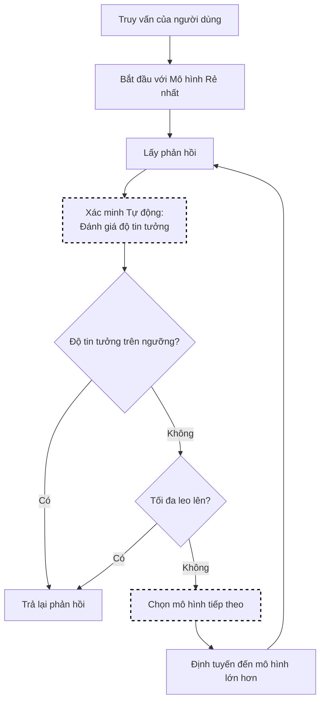

# Lựa Chọn AutoMix

AutoMix tối ưu hóa sự đánh đổi giữa chất lượng phản hồi và chi phí bằng cách sử dụng cách tiếp cận xếp tầng với xác minh tự động. Nó bắt đầu với các mô hình rẻ hơn và chỉ leo lên các mô hình đắt tiền hơn khi mức độ tin tưởng thấp.

Cách tiếp cận này có thể đạt được **>50% giảm chi phí** trong khi duy trì hiệu suất so sánh ([AutoMix](https://arxiv.org/abs/2310.12963), Madaan et al., NeurIPS 2024).

## Luồng Thuật toán



## Cách Hoạt Động

1. Truy vấn được gửi lần đầu tiên đến mô hình rẻ nhất theo thứ tự leo lên
2. Phản hồi được đánh giá bằng cách sử dụng **xác minh tự động kiểu ít chiều** để ước tính độ tin cậy
3. Nếu độ tin tưởng dưới ngưỡng, **bộ xác minh meta POMDP** quyết định có leo lên hay không
4. Quá trình lặp lại cho đến khi đạt được ngưỡng độ tin tưởng hoặc tối đa leo lên

### Thành Phần Chính

- **Xác minh Tự động Kiểu Ít Chiều**: Ước tính độ tin cậy đầu ra mà không cần đào tạo mở rộng, sử dụng khả năng riêng của mô hình để đánh giá chất lượng câu trả lời
- **Bộ Xác Minh Meta POMDP**: Xử lý các tín hiệu xác minh có tiếng ồn bằng cách sử dụng Quy trình Quyết định Markov Một phần Quan sát để đưa ra quyết định leo lên mạnh mẽ

## Cấu Hình

```yaml
decision:
  algorithm:
    type: automix
    automix:
      cost_quality_tradeoff: 0.3   # 0=chất lượng, 1=chi phí
      confidence_threshold: 0.7    # Ngưỡng leo lên
      escalation_order:            # Thứ tự tùy chọn rõ ràng
        - gpt-3.5-turbo
        - gpt-4
        - gpt-4-turbo

models:
  - name: gpt-4-turbo
    backend: openai
    quality_score: 0.95
    pricing:
      input_cost_per_1k: 0.01
      output_cost_per_1k: 0.03

  - name: gpt-4
    backend: openai
    quality_score: 0.90
    pricing:
      input_cost_per_1k: 0.03
      output_cost_per_1k: 0.06

  - name: gpt-3.5-turbo
    backend: openai
    quality_score: 0.75
    pricing:
      input_cost_per_1k: 0.0015
      output_cost_per_1k: 0.002
```

## Đánh đổi Chi phí-Chất lượng

Tham số `cost_quality_tradeoff` kiểm soát sự cân bằng:

| Giá trị | Hành vi |
|-------|--------|
| 0.0 | Luôn chọn mô hình chất lượng cao nhất |
| 0.3 | Ưu tiên chất lượng, cân nhắc chi phí (mặc định) |
| 0.5 | Cân bằng chất lượng và chi phí đều nhau |
| 0.7 | Ưu tiên mô hình rẻ hơn, chấp nhận sự đánh đổi chất lượng |
| 1.0 | Luôn chọn mô hình rẻ nhất |

## Điểm Chất Lượng

Điểm chất lượng phải phản ánh hiệu suất mô hình tương đối (0,0 đến 1,0):

```yaml
models:
  - name: gpt-4
    quality_score: 0.95   # Xuất sắc
  - name: gpt-3.5-turbo
    quality_score: 0.75   # Tốt
  - name: local-llama
    quality_score: 0.60   # Chấp nhận được
```

### Xác định Điểm Chất Lượng

1. **Kết quả điểm chuẩn**: Sử dụng điểm chuẩn tiêu chuẩn (MMLU, HumanEval, v.v.)
2. **Đánh giá nội bộ**: Chạy trên các trường hợp sử dụng cụ thể của bạn
3. **Phản hồi của người dùng**: Tập hợp các số liệu thỏa mãn
4. **Bắt đầu bảo thủ**: Đánh giá thấp, sau đó điều chỉnh lên

## Xếp tầng Độ tin tưởng

Với xếp tầng độ tin tưởng, AutoMix có thể bắt đầu với các mô hình rẻ hơn và leo lên:

```yaml
automix:
  confidence_method: cascade
  confidence_threshold: 0.7
  escalation_order:
    - gpt-3.5-turbo   # Thử đầu tiên (rẻ nhất)
    - gpt-4           # Leo lên nếu độ tin tưởng thấp
    - gpt-4-turbo     # Leo lên cuối cùng
```

Bộ định tuyến thử mô hình đầu tiên; nếu độ tin tưởng phản hồi dưới ngưỡng, nó sẽ leo lên mô hình tiếp theo.

## Các Thực Hành Tốt Nhất

1. **Giá cả chính xác**: Giữ dữ liệu giá cả cập nhật
2. **Hiệu chỉnh điểm chất lượng**: Dựa trên các chỉ số hiệu suất thực tế
3. **Bắt đầu bảo thủ**: Bắt đầu với sự đánh đổi thấp hơn (ưu tiên chất lượng)
4. **Giám sát chi phí**: Theo dõi tiết kiệm chi phí thực tế so với tác động chất lượng
5. **Thử nghiệm A/B**: So sánh AutoMix với định tuyến tĩnh
