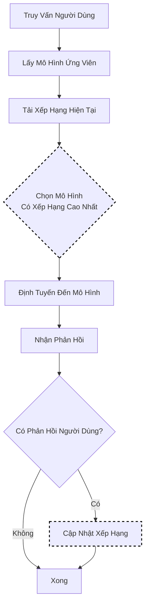

# Lựa Chọn Xếp Hạng Elo

Lựa chọn Xếp Hạng Elo sử dụng một **hệ thống xếp hạng thời gian chạy** để xếp hạng các mô hình dựa trên phản hồi của người dùng. Các mô hình nhận phản hồi tích cực sẽ tăng điểm xếp hạng; những mô hình có phản hồi tiêu cực sẽ mất điểm. Theo thời gian, các mô hình hoạt động tốt hơn sẽ lên top và được lựa chọn thường xuyên hơn.

Phương pháp này sử dụng mô hình Bradley-Terry (khung so sánh cặp) để liên tục cải thiện lựa chọn mô hình thông qua học tập trực tuyến.

> **Ghi chú về RouteLLM**: Bài báo [RouteLLM](https://arxiv.org/abs/2406.18665) (Ong et al.) huấn luyện **các mô hình router tĩnh** trên dữ liệu ưu tiên và đạt được ~50% giảm chi phí (tiết kiệm 2 lần). Cách triển khai của chúng tôi sử dụng một phương pháp khác: một **hệ thống xếp hạng Elo thời gian chạy** cập nhật động dựa trên phản hồi trực tiếp thay vì định tuyến tĩnh được huấn luyện trước.

## Luồng Thuật Toán



## Nền Tảng Toán Học

### Điểm Dự Kiến (Mô Hình Bradley-Terry)

Xác suất dự kiến rằng mô hình A thắng mô hình B:

```text
E_A = 1 / (1 + 10^((R_B - R_A) / 400))
```

Ở đâu:

- `R_A` = Xếp hạng của mô hình A
- `R_B` = Xếp hạng của mô hình B
- `E_A` = Điểm dự kiến (xác suất A thắng)

### Cập Nhật Xếp Hạng

Sau phản hồi, xếp hạng được cập nhật như sau:

```text
R'_A = R_A + K × (S_A - E_A)
```

Ở đâu:

- `K` = Hệ số K (kiểm soát độ biến động, mặc định: 32)
- `S_A` = Kết quả thực tế (1 = thắng, 0,5 = hoà, 0 = thua)
- `E_A` = Điểm dự kiến

### Ví Dụ Tính Toán

```text
Mô hình A: Xếp hạng 1500, Mô hình B: Xếp hạng 1400
Điểm dự kiến cho A: 1 / (1 + 10^((1400-1500)/400)) = 0.64

Nếu A thắng (S_A = 1):
  Xếp hạng mới = 1500 + 32 × (1 - 0.64) = 1500 + 11.5 = 1511.5

Nếu A thua (S_A = 0):
  Xếp hạng mới = 1500 + 32 × (0 - 0.64) = 1500 - 20.5 = 1479.5
```

## Thuật Toán Cơ Bản (Go)

```go
// Select trả về mô hình với xếp hạng Elo cao nhất
func (s *EloSelector) Select(ctx context.Context, selCtx *SelectionContext) (*SelectionResult, error) {
    var bestModel string
    var bestRating float64 = math.Inf(-1)

    for _, candidate := range selCtx.CandidateModels {
        rating := s.getRating(candidate.Model, selCtx.DecisionName)
        if rating > bestRating {
            bestRating = rating
            bestModel = candidate.Model
        }
    }

    return &SelectionResult{
        SelectedModel: bestModel,
        Score:         bestRating,
        Method:        MethodElo,
    }, nil
}

// UpdateFeedback điều chỉnh xếp hạng dựa trên phản hồi người dùng
func (s *EloSelector) UpdateFeedback(winner, loser string, tie bool) {
    ratingA := s.getRating(winner)
    ratingB := s.getRating(loser)

    // Tính toán điểm dự kiến
    expectedA := 1.0 / (1.0 + math.Pow(10, (ratingB-ratingA)/400.0))
    expectedB := 1.0 - expectedA

    // Điểm thực tế
    var actualA, actualB float64
    if tie {
        actualA, actualB = 0.5, 0.5
    } else {
        actualA, actualB = 1.0, 0.0
    }

    // Cập nhật xếp hạng
    s.setRating(winner, ratingA + s.kFactor*(actualA-expectedA))
    s.setRating(loser, ratingB + s.kFactor*(actualB-expectedB))
}
```

## Cách Hoạt Động

1. Tất cả các mô hình bắt đầu với xếp hạng ban đầu (mặc định: 1500)
2. Người dùng cung cấp phản hồi (cái cộc/cái trừ) sau khi nhận phản hồi
3. Xếp hạng điều chỉnh dựa trên phản hồi và kết quả "dự kiến"
4. Các mô hình có xếp hạng cao hơn được lựa chọn thường xuyên hơn

## Cấu Hình

```yaml
decision:
  algorithm:
    type: elo
    elo:
      k_factor: 32              # Tốc độ thay đổi xếp hạng (16-64 điển hình)
      initial_rating: 1500      # Xếp hạng ban đầu cho mô hình mới
      storage_path: /data/elo-ratings.json  # Lưu trữ xếp hạng
      auto_save_interval: 1m    # Tần suất lưu

models:
  - name: gpt-4
    backend: openai
  - name: gpt-3.5-turbo
    backend: openai
  - name: claude-3-opus
    backend: anthropic
```

## Gửi Phản Hồi

Sử dụng API phản hồi để cập nhật xếp hạng mô hình:

```bash
# Phản hồi tích cực (mô hình hoạt động tốt)
curl -X POST http://localhost:8080/api/v1/feedback \
  -H "Content-Type: application/json" \
  -d '{
    "request_id": "req-123",
    "model": "gpt-4",
    "rating": 1
  }'

# Phản hồi tiêu cực (mô hình hoạt động kém)
curl -X POST http://localhost:8080/api/v1/feedback \
  -H "Content-Type: application/json" \
  -d '{
    "request_id": "req-456",
    "model": "gpt-3.5-turbo",
    "rating": -1
  }'
```

## Xem Xếp Hạng Hiện Tại

```bash
curl http://localhost:8080/api/v1/ratings
```

Phản hồi:

```json
{
  "ratings": {
    "gpt-4": 1632,
    "gpt-3.5-turbo": 1485,
    "claude-3-opus": 1558
  },
  "last_updated": "2024-01-15T10:30:00Z"
}
```

## Điều Chỉnh Hệ Số K

| Hệ Số K | Hành Vi | Trường Hợp Sử Dụng |
|----------|--------|----------|
| 16 | Thay đổi chậm, ổn định | Hệ thống trưởng thành với phản hồi nhất quán |
| 32 | Cân bằng (mặc định) | Hầu hết các trường hợp sản xuất |
| 64 | Thay đổi nhanh, biến động | Thử nghiệm nhanh, triển khai mới |

## Lưu Trữ Liên Tục

Bật `storage_path` để lưu xếp hạng qua các lần khởi động lại:

```yaml
elo:
  storage_path: /data/elo-ratings.json
  auto_save_interval: 1m
```

Tệp được ghi an toàn nguyên tử và bao gồm quay vòng sao lưu.

## Thực Hành Tốt Nhất

1. **Thu thập phản hồi nhất quán**: Đảm bảo phản hồi phản ánh chất lượng thực tế
2. **Bắt đầu với hệ số K mặc định**: Chỉ điều chỉnh sau khi quan sát hành vi
3. **Bật tính liên tục**: Tránh mất xếp hạng khi khởi động lại
4. **Giám sát sự trôi dạt xếp hạng**: Theo dõi các mô hình chiếm ưu thế không công bằng
5. **Bootstrap với các ưu tiên**: Đặt xếp hạng ban đầu dựa trên chất lượng đã biết nếu có
