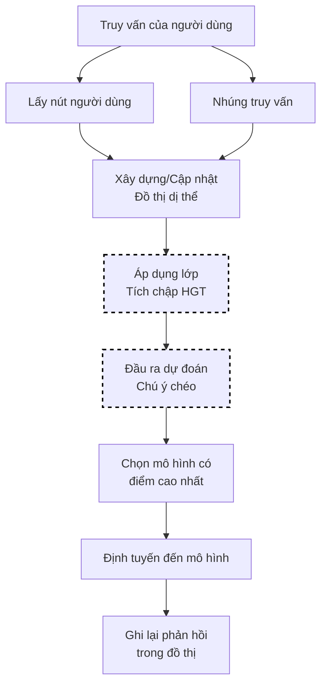

# Lựa Chọn GMTRouter

GMTRouter sử dụng mạng thần kinh đồ thị dị thể để học các quyết định định tuyến được cá nhân hóa dựa trên tương tác người dùng nhiều vòng. Nó xây dựng một đồ thị nắm bắt mối quan hệ giữa người dùng-LLM-truy vấn-phản hồi và học tập những mô hình nào hoạt động tốt nhất cho từng người dùng theo thời gian.

Cách tiếp cận được cá nhân hóa này có thể đạt được **0,9% - 21,6% độ chính xác cao hơn** và **0,006 - 0,309 AUC cao hơn** so với định tuyến không được cá nhân hóa.

> **Tham khảo**: [GMTRouter: Personalized LLM Router over Multi-turn User Interactions](https://arxiv.org/abs/2511.08590) của Wang et al. Cách triển khai của chúng tôi được lấy cảm hứng từ cách tiếp cận cá nhân hóa dựa trên đồ thị trong bài báo này.

## Luồng Thuật toán



## Nền Tảng Toán Học

### Cấu Trúc Đồ Thị Dị Thể

Đồ thị chứa 4 loại nút để nắm bắt các mẫu tương tác nhiều vòng:

```text
G = (V, E) trong đó V = V_user ∪ V_llm ∪ V_query ∪ V_response
```

Các loại nút:

- **Nút người dùng**: Đại diện cho các người dùng cá nhân với lịch sử tương tác của họ
- **Nút LLM**: Đại diện cho các mô hình ngôn ngữ có sẵn
- **Nút truy vấn**: Đại diện cho các truy vấn do người dùng gửi
- **Nút phản hồi**: Ghi lại các đầu ra mô hình và các tín hiệu chất lượng

Các nút **vòng ảo** kết nối các tương tác tuần tự trong một cuộc trò chuyện.

### Lớp Tích Chập HGT

Bài báo sử dụng tích chập Heterogeneous Graph Transformer (HGT) với chuẩn hóa lớp:

```text
h_v^(l+1) = LayerNorm(h_v^(l) + HGTConv(h_v^(l), {h_u^(l) : u ∈ N(v)}))

HGTConv áp dụng chú ý cụ thể về loại:
  Attention(v, u) = softmax_u(W_τ(v),τ(u) · h_v · h_u^T / √d)
```

trong đó τ(v) ký hiệu loại nút của v.

### Đầu Ra Dự Đoán Chú Ý Chéo

Điểm ưu tiên người dùng-mô hình cuối cùng sử dụng chú ý chéo:

```text
s_{u,q,m} = f_pred(h_u^(L), h_q^(0), h_m^(L))

trong đó:
  h_u^(L) = nhúng người dùng sau L lớp
  h_q^(0) = nhúng truy vấn
  h_m^(L) = nhúng mô hình sau L lớp
```

## Thuật Toán Cốt Lõi (Go)

```go
// Chọn sử dụng học tập ưu tiên dựa trên đồ thị
func (s *GMTRouterSelector) Select(ctx context.Context, selCtx *SelectionContext) (*SelectionResult, error) {
    userID := s.getUserID(selCtx)
    queryEmbed := s.embedQuery(selCtx.Query)

    // Cập nhật đồ thị bằng nút truy vấn mới
    s.addQueryNode(userID, queryEmbed)

    // Chạy các lớp tích chập HGT
    embeddings := s.runHGTLayers(userID)

    // Tính toán điểm ưu tiên thông qua chú ý chéo
    var bestModel string
    var bestScore float64 = -1

    for _, candidate := range selCtx.CandidateModels {
        userEmbed := embeddings.User[userID]
        modelEmbed := embeddings.LLM[candidate.Model]

        score := s.crossAttentionPredict(userEmbed, queryEmbed, modelEmbed)

        if score > bestScore {
            bestScore = score
            bestModel = candidate.Model
        }
    }

    return &SelectionResult{
        SelectedModel: bestModel,
        Score:         bestScore,
        Method:        MethodGMTRouter,
    }, nil
}
```

## Cách Hoạt Động

1. Xây dựng một đồ thị dị thể có 4 loại nút: người dùng, LLM, truy vấn, phản hồi
2. Kết nối các nút để tạo thành các chuỗi tương tác nhiều vòng (thông qua các nút vòng ảo)
3. Áp dụng các lớp tích chập HGT để học các nhúng
4. Sử dụng đầu ra dự đoán chú ý chéo để tính toán ưu tiên mô hình cụ thể cho người dùng
5. Chọn mô hình có điểm ưu tiên cao nhất cho người dùng

## Cấu Hình

```yaml
decision:
  algorithm:
    type: gmtrouter
    gmtrouter:
      num_layers: 2           # Độ sâu lớp HGT
      hidden_dim: 64          # Kích thước chiều nhúng
      num_heads: 4            # Đầu chú ý
      learn_preferences: true # Kích hoạt học tập ưu tiên
      model_path: null        # Trọng số được đào tạo trước tùy chọn

models:
  - name: gpt-4
    backend: openai
  - name: gpt-3.5-turbo
    backend: openai
  - name: claude-3-opus
    backend: anthropic
```

## Tham Số Chính

| Tham số | Mặc định | Mô tả |
|---------|---------|-------|
| `num_layers` | 2 | Số lớp HGT (1-5) |
| `hidden_dim` | 64 | Kích thước chiều ẩn |
| `num_heads` | 4 | Số đầu chú ý |
| `learn_preferences` | true | Kích hoạt học tập ưu tiên trực tuyến |
| `model_path` | null | Đường dẫn đến trọng số mô hình được đào tạo trước |

## Cấu Trúc Đồ Thị

GMTRouter xây dựng một đồ thị nắm bắt các tương tác nhiều vòng:

```
User ←→ Query ←→ Response ←→ LLM
         ↑           ↑
         └── Turn ───┘
```

Các cạnh đại diện cho:

- User-Query: Người dùng đã gửi truy vấn này
- Query-Response: Truy vấn nhận được phản hồi này
- Response-LLM: Phản hồi được tạo ra bởi LLM này
- Cạnh vòng: Kết nối các tương tác tuần tự trong một cuộc trò chuyện

## Đào Tạo Trước (Tùy Chọn)

Để có hiệu suất khởi động lạnh tốt hơn, hãy đào tạo trước trên dữ liệu lịch sử:

```bash
cd src/training/rl_model_selection
python train_gmtrouter.py --data_path ./data/interactions.json
```

Sau đó tham chiếu mô hình:

```yaml
gmtrouter:
  model_path: /models/gmtrouter_trained.pt
```

## Khi Nào Sử Dụng GMTRouter

**Phù hợp cho:**

- Môi trường nhiều người dùng với sở thích đa dạng
- Hệ thống có lịch sử tương tác nhiều vòng phong phú
- Yêu cầu cá nhân hóa trên các cuộc trò chuyện

**Cân nhắc các giải pháp thay thế khi:**

- Có ít người dùng (dữ liệu không đủ để cá nhân hóa)
- Không có dữ liệu lịch sử
- Các ứng dụng nhạy cảm về độ trễ (GNN thêm ~10ms)

## Các Thực Hành Tốt Nhất

1. **Bắt đầu mà không cần đào tạo trước**: Học tập trực tuyến hoạt động cho nhiều trường hợp
2. **Thu thập dữ liệu tương tác**: Càng nhiều vòng = cá nhân hóa tốt hơn
3. **Giám sát các chỉ số trên mỗi người dùng**: Xác minh rằng cá nhân hóa đang hoạt động
4. **Sử dụng hidden_dim vừa phải**: 64 cân bằng chất lượng và tốc độ
