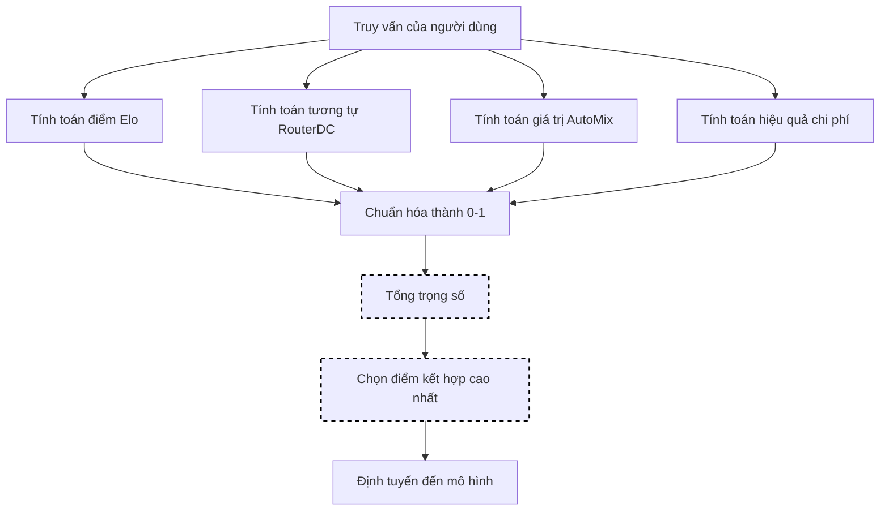

# Lựa Chọn Kết Hợp

Lựa chọn kết hợp kết hợp nhiều phương thức lựa chọn (Elo, RouterDC, AutoMix, Chi phí) với trọng số có thể cấu hình. Điều này cho phép bạn cân bằng các yếu tố khác nhau như lịch sử phản hồi của người dùng, khớp ngữ nghĩa, hiệu quả chi phí và điểm chất lượng để lựa chọn mô hình tối ưu.

> **Ghi chú về bài báo Hybrid LLM**: Bài báo [Hybrid LLM](https://arxiv.org/abs/2404.14618) (Ding et al.) đào tạo một **bộ dự đoán chênh lệch chất lượng dựa trên BERT** cho định tuyến nhị phân giữa hai mô hình, đạt được tối đa **40% cuộc gọi mô hình đắt tiền ít hơn**. Cách triển khai của chúng tôi sử dụng một cách tiếp cận khác: một **tập hợp có trọng số** kết hợp các tín hiệu nhiều (xếp hạng Elo, tương tự ngữ nghĩa, giá trị POMDP, chi phí) thay vì một bộ phân loại nhị phân được đào tạo.

## Luồng Thuật toán



## Nền Tảng Toán Học

### Công Thức Điểm Kết Hợp

```text
score(m, q) = w_elo × E(m) + w_dc × S(q,m) + w_mix × V(m,q) + w_cost × C(m)
```

Trong đó:

- `E(m)` = Xếp hạng Elo chuẩn hóa
- `S(q, m)` = Tương tự RouterDC chuẩn hóa
- `V(m, q)` = Giá trị AutoMix chuẩn hóa
- `C(m)` = Hiệu quả chi phí chuẩn hóa (1 - relative_cost)
- `Σw_i = 1` (trọng số phải tính tổng bằng 1)

### Chuẩn hóa điểm

Mỗi thành phần được chuẩn hóa thành [0, 1]:

| Thành phần | Chuẩn hóa |
|-----------|----------|
| Elo | `E = (R - 1000) / 1000` (cặp) |
| RouterDC | Đã ở [0, 1] (tương tự cosin) |
| AutoMix | `V = (V - V_min) / (V_max - V_min)` |
| Chi phí | `C = 1 - (cost / max_cost)` |

## Thuật Toán Cốt Lõi (Go)

```go
// Chọn sử dụng sự kết hợp có trọng số của các phương thức
func (s *HybridSelector) Select(ctx context.Context, selCtx *SelectionContext) (*SelectionResult, error) {
    var bestModel string
    var bestScore float64 = -1

    for _, candidate := range selCtx.CandidateModels {
        eloScore := s.normalizeElo(s.eloSelector.GetRating(candidate.Model))
        dcScore := s.routerDCSelector.GetSimilarity(selCtx.Query, candidate.Model)
        mixScore := s.normalizePOMDP(s.autoMixSelector.GetValue(candidate.Model, selCtx.Query))
        costScore := s.normalizeCost(s.getCost(candidate.Model))

        combined := s.eloWeight*eloScore +
                    s.routerDCWeight*dcScore +
                    s.autoMixWeight*mixScore +
                    s.costWeight*costScore

        if combined > bestScore {
            bestScore = combined
            bestModel = candidate.Model
        }
    }

    return &SelectionResult{
        SelectedModel: bestModel,
        Score:         bestScore,
        Method:        MethodHybrid,
    }, nil
}
```

## Cách Hoạt Động

Điểm kết hợp được tính toán như sau:

```text
combined = w1 × elo + w2 × similarity + w3 × pomdp + w4 × cost_efficiency
```

## Cấu Hình

```yaml
decision:
  algorithm:
    type: hybrid
    hybrid:
      elo_weight: 0.3
      router_dc_weight: 0.3
      automix_weight: 0.2
      cost_weight: 0.2
      normalize_scores: true

      # Cấu hình phương thức cơ bản
      elo:
        k_factor: 32
        initial_rating: 1500
      router_dc:
        require_descriptions: true
      automix:
        cost_quality_tradeoff: 0.3

models:
  - name: gpt-4
    description: "Lý luận nâng cao và phân tích"
    capabilities: ["reasoning", "code", "analysis"]
    quality_score: 0.95
    pricing:
      input_cost_per_1k: 0.03
      output_cost_per_1k: 0.06
  - name: gpt-3.5-turbo
    description: "Phản hồi dạng chung nhanh chóng"
    capabilities: ["general", "chat"]
    quality_score: 0.75
    pricing:
      input_cost_per_1k: 0.0015
      output_cost_per_1k: 0.002
```

## Cài Đặt Trọng Số

| Cài đặt | Elo | RouterDC | AutoMix | Chi phí | Trường hợp sử dụng |
|---------|-----|----------|---------|---------|----------|
| Cân bằng | 0.25 | 0.25 | 0.25 | 0.25 | Mục đích chung |
| Tập trung vào chất lượng | 0.4 | 0.3 | 0.2 | 0.1 | Các tác vụ có tính chất cao |
| Tập trung vào chi phí | 0.1 | 0.2 | 0.2 | 0.5 | Tiết kiệm ngân sách |
| Tập trung vào học tập | 0.5 | 0.2 | 0.2 | 0.1 | Thích ứng nhanh chóng |

## Yêu Cầu

Để lựa chọn kết hợp hoạt động tối ưu:

1. **Thành phần Elo**: Thu thập phản hồi của người dùng qua `/api/v1/feedback`
2. **Thành phần RouterDC**: Cung cấp mô tả mô hình và khả năng
3. **Thành phần AutoMix**: Cấu hình giá cả và điểm chất lượng
4. **Trọng số phải tính tổng bằng 1,0** (công sai ±0,01)

## Chuẩn hóa Điểm

Khi `normalize_scores: true` (mặc định), tất cả các điểm thành phần được chuẩn hóa thành [0, 1] trước khi cân nhắc:

- **Elo**: `(rating - 1000) / 1000` (cắn)
- **RouterDC**: Tương tự ngữ nghĩa cosin đã ở [0, 1]
- **AutoMix**: Giá trị POMDP được chuẩn hóa theo giá trị tối đa có thể
- **Chi phí**: `1 - (cost / max_cost)` (đảo ngược vì chi phí thấp hơn = điểm cao hơn)

## Các Thực Hành Tốt Nhất

1. **Bắt đầu cân bằng**: Bắt đầu với trọng số bằng nhau, sau đó điều chỉnh dựa trên hành vi quan sát được
2. **Giám sát các thành phần**: Theo dõi thành phần nào đóng góp nhiều nhất cho các lựa chọn cuối cùng
3. **Điều chỉnh dần dần**: Điều chỉnh trọng số theo các bước tăng 0,05-0,1
4. **Xác thực trọng số**: Đảm bảo trọng số tính tổng bằng 1,0 để tránh lỗi xác thực
