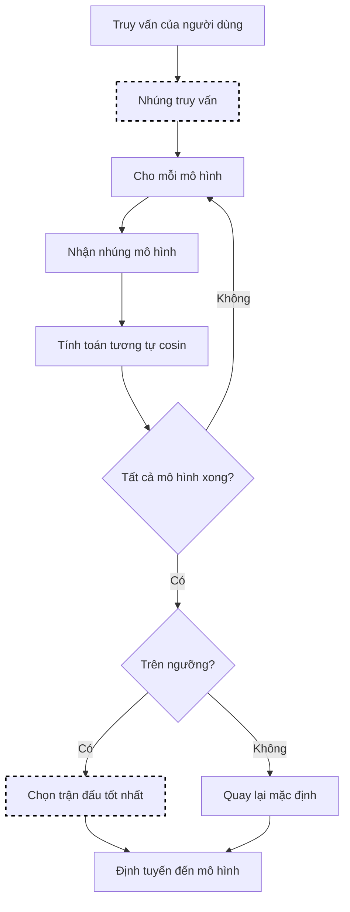

# Lựa Chọn RouterDC

RouterDC sử dụng nhúng ngữ nghĩa để khớp các truy vấn người dùng với mô hình phù hợp nhất. Nó tính toán tương tự giữa nhúng truy vấn và biểu diễn mô hình để chọn trận đấu tốt nhất.

> **Tham khảo**: [RouterDC: Query-Based Router by Dual Contrastive Learning](https://arxiv.org/abs/2409.19886) (Guo et al., NeurIPS 2024) đạt được **+2,76%** độ chính xác trong phân phối và **+1,90%** cải thiện độ chính xác ngoài phân phối.
>
> Bài báo đào tạo một bộ mã hóa truy vấn bằng cách sử dụng **lỗi đối ngẫu kép** (Mất mát mẫu-LLM + Mất mát mẫu-mẫu) với nhúng LLM được học chung. Cách triển khai của chúng tôi cung cấp một **cách tiếp cận đơn giản hóa** sử dụng nhúng được tính toán trước của mô tả mô hình thay vì nhúng riêng cho LLM được đào tạo chung.

## Luồng Thuật toán



## Nền Tảng Toán Học

### Tương Tự Cosin

RouterDC sử dụng tương tự cosin để so sánh nhúng truy vấn và mô hình:

```text
sim(q, m) = (q · m) / (||q|| × ||m||)
          = Σ(q_i × m_i) / (√Σq_i² × √Σm_i²)
```

Trong đó:

- `q` = Vectơ nhúng truy vấn (ví dụ: 768 kích thước)
- `m` = Vectơ nhúng mô tả mô hình
- Kết quả nằm trong phạm vi [-1, 1], cao hơn = tương tự hơn

### Học Tập Đối Ngẫu

Không gian nhúng traininguage sử dụng lỗi đối ngẫu kép:

- **Mất mát Mẫu-LLM**: Kéo nhúng truy vấn về phía các mô hình hoạt động tốt và cách xa các mô hình hoạt động kém
- **Mất mát Mẫu-Mẫu**: Nhóm các truy vấn tương tự nhau để đảm bảo định tuyến nhất quán

## Thuật Toán Cốt Lõi (Go)

```go
// Chọn sử dụng tương tự nhúng
func (s *RouterDCSelector) Select(ctx context.Context, selCtx *SelectionContext) (*SelectionResult, error) {
    queryEmbedding, err := s.embedFunc(selCtx.Query)
    if err != nil {
        return nil, err
    }

    var bestModel string
    var bestSim float64 = -1

    for _, candidate := range selCtx.CandidateModels {
        modelEmbedding := s.modelEmbeddings[candidate.Model]
        sim := cosineSimilarity(queryEmbedding, modelEmbedding)

        if sim > bestSim {
            bestSim = sim
            bestModel = candidate.Model
        }
    }

    if bestSim < s.config.SimilarityThreshold {
        return s.fallbackToDefault(selCtx)
    }

    return &SelectionResult{
        SelectedModel: bestModel,
        Score:         bestSim,
        Method:        MethodRouterDC,
    }, nil
}
```

## Cách Hoạt Động

1. Mỗi mô hình có mô tả và danh sách khả năng tùy chọn
2. Các truy vấn đến được nhúng thành biểu diễn vectơ
3. Nhúng truy vấn được so sánh với nhúng mô tả mô hình
4. Mô hình có điểm tương tự cao nhất được chọn

## Cấu Hình

```yaml
decision:
  algorithm:
    type: router_dc
    router_dc:
      require_descriptions: true   # Thất bại nếu các mô hình thiếu mô tả
      use_capabilities: true       # Bao gồm khả năng trong so sánh
      similarity_threshold: 0.3    # Tương tự tối thiểu để cân nhắc

models:
  - name: gpt-4
    backend: openai
    description: "Lý luận nâng cao, phân tích phức tạp, chứng minh toán học và giải thích chi tiết"
    capabilities:
      - reasoning
      - mathematics
      - code-review
      - analysis

  - name: gpt-3.5-turbo
    backend: openai
    description: "Phản hồi nhanh cho các câu hỏi đơn giản, trò chuyện bình thường và các tác vụ nhanh chóng"
    capabilities:
      - general
      - chat
      - summarization

  - name: code-llama
    backend: local
    description: "Tạo mã, gỡ lỗi, refactoring và hỗ trợ lập trình"
    capabilities:
      - code-generation
      - debugging
      - refactoring
```

## Viết Mô Tả Hiệu Quả

Các mô tả tốt là cụ thể và phân biệt các mô hình:

**Tốt:**

```yaml
description: "Lý luận toán học, chứng minh định lý, giải quyết vấn đề từng bước"
```

**Tệ:**

```yaml
description: "Mô hình AI tốt"  # Quá mơ hồ
```

### Mẹo Mô Tả

1. **Cụ thể**: Đề cập đến các tác vụ cụ thể mô hình xuất sắc
2. **Sử dụng từ khóa**: Bao gồm các điều khoản mà người dùng có thể sử dụng trong truy vấn
3. **Phân biệt**: Làm nổi bật những gì làm cho mô hình này độc đáo
4. **Giữ ngắn gọn**: 1-2 câu, tập trung vào điểm mạnh

## Danh Sách Khả Năng

Khả năng cung cấp siêu dữ liệu có cấu trúc cho so sánh:

```yaml
capabilities:
  - code-generation    # Điểm mạnh chính
  - python             # Chuyên môn về ngôn ngữ
  - debugging          # Tác vụ liên quan
```

Khi `use_capabilities: true`, khả năng được kết hợp với mô tả để so sánh phong phú hơn.

## Xác Thực

Kích hoạt xác thực nghiêm ngặt để bắt các vấn đề cấu hình:

```yaml
router_dc:
  require_descriptions: true
```

Với tùy chọn này được bật, bộ định tuyến sẽ bị lỗi khởi động nếu bất kỳ mô hình nào thiếu mô tả.

## Các Thực Hành Tốt Nhất

1. **Đầu tư vào mô tả**: Mô tả chất lượng cải thiện đáng kể định tuyến
2. **Kiểm tra với các truy vấn thực tế**: Xác minh định tuyến khớp với kỳ vọng
3. **Cập nhật mô tả**: Tinh chỉnh dựa trên các lộ trình sai được quan sát
4. **Sử dụng khả năng một cách tiết kiệm**: 3-5 khả năng tập trung mỗi mô hình
5. **Kích hoạt require_descriptions**: Bắt các mô tả bị thiếu khi khởi động
