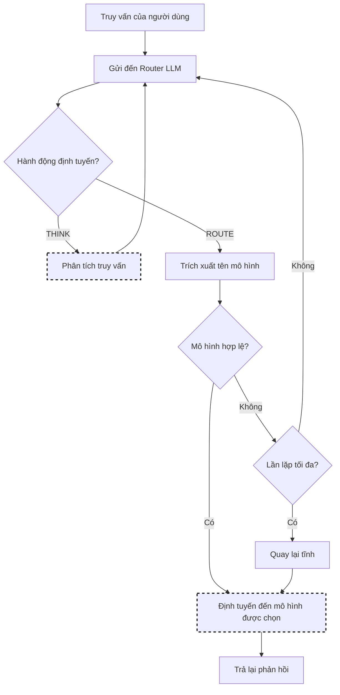

# Lựa Chọn Router-R1

Router-R1 sử dụng một LLM làm bộ định tuyến, thực hiện các hành động "suy nghĩ" và "định tuyến" nhiều vòng để đưa ra các quyết định định tuyến thông minh. Bộ định tuyến có thể lý luận về các yêu cầu truy vấn, khả năng mô hình và những sự đánh đổi về chi phí trước khi đưa ra lựa chọn.

> **Tham khảo**: [Router-R1: Teaching LLMs Multi-Round Routing and Aggregation via Reinforcement Learning](https://arxiv.org/abs/2506.09033) của Hu et al., NeurIPS 2025. Cách triển khai của chúng tôi được lấy cảm hứng từ mẫu hành động suy nghĩ/định tuyến của bài báo này.

## Bài báo so với Cách triển khai

Bài báo của Router-R1 giới thiệu **định tuyến nhiều vòng, nhiều mô hình và tổng hợp** - bộ định tuyến gọi nhiều mô hình tuần tự, tích hợp phản hồi của chúng vào bối cảnh và tổng hợp câu trả lời cuối cùng. Đây là đóng góp cốt lõi của bài báo.

Cách triển khai của chúng tôi cung cấp một **biến thể lựa chọn mô hình đơn giản hóa** sử dụng mẫu hành động suy nghĩ/định tuyến cho định tuyến thân thiện. Để tổng hợp nhiều mô hình đầy đủ, hãy xem cấu hình nâng cao dưới đây.

## Luồng Thuật toán



## Giao Thức Suy Nghĩ/Định Tuyến

Router LLM sử dụng định dạng đầu ra có cấu trúc với hai loại hành động:

| Hành động | Mô tả |
|---------|-------|
| `<think>...</think>` | Bước lý luận - phân tích truy vấn (có thể lặp lại) |
| `<route>model</route>` | Quyết định định tuyến cuối cùng |

### Đầu Ra Mẫu

```text
<think>
Phân tích truy vấn: "Gỡ lỗi đoạn mã Python này"
- Loại truy vấn: tác vụ mã hóa
- Yêu cầu: hiểu mã, gỡ lỗi
- Mô hình tốt nhất: code-llama (cụ chuyên cho mã)
</think>
<route>code-llama</route>
```

## Cách Hoạt Động

### Lựa Chọn Mô Hình Đơn Lẻ (Mặc định)

1. Router LLM nhận truy vấn người dùng và mô tả mô hình
2. LLM thực hiện các hành động **SỮ NGHĨ** để phân tích các yêu cầu truy vấn
3. LLM thực hiện hành động **ROUTE** để chọn mô hình tốt nhất
4. Mô hình được chọn xử lý yêu cầu
5. Nếu lộ trình không hợp lệ, hãy thử lại tối đa lần lặp

### Tổng Hợp Nhiều Mô Hình (Nâng cao)

Khi `enable_aggregation: true`, Router-R1 có thể gọi nhiều mô hình:

1. Router LLM lý luận về mô hình nào cần tham khảo
2. Router gọi Mô hình A, nhận phản hồi, tích hợp vào bối cảnh
3. Router quyết định có nên gọi mô hình bổ sung hay không
4. Router tổng hợp câu trả lời cuối cùng từ tất cả các phản hồi

Điều này khớp với cách tiếp cận tổng hợp nhiều vòng của bài báo.

## Đào Tạo Dựa Trên RL

Bộ định tuyến được đào tạo bằng cách sử dụng học tăng cường với phần thưởng cho:

- **Độ chính xác định dạng**: Sử dụng đúng các thẻ suy nghĩ/định tuyến
- **Chất lượng kết quả**: Chất lượng của phản hồi cuối cùng
- **Hiệu quả chi phí**: Cân bằng giữa hiệu suất và chi phí

## Thuật Toán Cốt Lõi (Go)

```go
// Chọn sử dụng LLM-as-Router
func (s *RouterR1Selector) Select(ctx context.Context, selCtx *SelectionContext) (*SelectionResult, error) {
    if s.routerEndpoint == "" && s.fallbackToStatic {
        return s.staticSelector.Select(ctx, selCtx)
    }

    history := []string{}

    for i := 0; i < s.maxIterations; i++ {
        response, err := s.callRouterLLM(ctx, selCtx.Query, selCtx.ModelDescriptions, history)
        if err != nil {
            if s.fallbackToStatic {
                return s.staticSelector.Select(ctx, selCtx)
            }
            return nil, err
        }

        action := s.parseAction(response)

        if action.Type == ActionRoute {
            if s.isValidModel(action.Model, selCtx.CandidateModels) {
                return &SelectionResult{
                    SelectedModel: action.Model,
                    Method:        MethodRouterR1,
                    Reason:        action.Reasoning,
                }, nil
            }
        }

        history = append(history, response)
    }

    // Đã đạt tối đa lần lặp
    if s.fallbackToStatic {
        return s.staticSelector.Select(ctx, selCtx)
    }
    return nil, fmt.Errorf("router failed after %d iterations", s.maxIterations)
}
```

## Cấu Hình

### Lựa Chọn Mô Hình Đơn Lẻ

```yaml
decision:
  algorithm:
    type: router_r1
    router_r1:
      router_endpoint: http://localhost:8001  # Máy chủ Router LLM
      max_iterations: 3        # Tối đa chu kỳ suy nghĩ/định tuyến
      temperature: 0.7         # Nhiệt độ Router LLM
      use_cot: true           # Kích hoạt lý luận chuỗi suy nghĩ
      fallback_to_static: true # Quay lại nếu bộ định tuyến không khả dụng

models:
  - name: gpt-4
    backend: openai
    description: "Lý luận phức tạp và phân tích"
  - name: gpt-3.5-turbo
    backend: openai
    description: "Phản hồi chung nhanh"
  - name: code-llama
    backend: local
    description: "Tạo mã và gỡ lỗi"
```

### Tổng Hợp Nhiều Mô Hình (Nâng cao)

```yaml
decision:
  algorithm:
    type: router_r1
    router_r1:
      router_endpoint: http://localhost:8001
      enable_aggregation: true  # Kích hoạt gọi nhiều mô hình
      max_models_per_query: 3   # Tối đa mô hình để tham khảo
      aggregation_strategy: "synthesize"  # hoặc "best_of"
```

## Tham Số Chính

| Tham số | Mặc định | Mô tả |
|---------|---------|-------|
| `router_endpoint` | null | URL của máy chủ Router-R1 |
| `max_iterations` | 3 | Lần lặp suy nghĩ/định tuyến tối đa |
| `temperature` | 0.7 | Nhiệt độ cho Router LLM |
| `use_cot` | true | Kích hoạt lý luận chuỗi suy nghĩ |
| `fallback_to_static` | true | Sử dụng lựa chọn tĩnh nếu bộ định tuyến không khả dụng |
| `enable_aggregation` | false | Kích hoạt tổng hợp nhiều mô hình |

## Máy Chủ Router-R1

Router-R1 yêu cầu một máy chủ riêng chạy Router LLM:

```bash
cd src/training/rl_model_selection
python router_r1_server.py --port 8001 --model Qwen/Qwen2.5-3B-Instruct
```

Máy chủ tiếp xúc:

- `POST /route` - Định tuyến một truy vấn đến một mô hình

## Không Có Máy Chủ Router

Nếu `router_endpoint` là null và `fallback_to_static: true`, Router-R1 sẽ quay lại lựa chọn tĩnh. Điều này cho phép áp dụng dần:

1. Triển khai với `fallback_to_static: true`
2. Bắt đầu máy chủ Router-R1 khi sẵn sàng
3. Cấu hình `router_endpoint`

## Khi Nào Sử Dụng Router-R1

**Phù hợp cho:**

- Định tuyến phức tạp rất khó để mã hóa trong các quy tắc
- Truy vấn cần cảm hiểu ngữ nghĩa
- Hệ thống có các mô hình chuyên dụng đa dạng
- Tổng hợp nhiều mô hình (với tổng hợp được bật)

**Cân nhắc các giải pháp thay thế khi:**

- Độ trễ là quan trọng (định tuyến LLM thêm 100-500ms)
- Các quy tắc định tuyến đơn giản đủ
- Không có GPU có sẵn cho LLM bộ định tuyến

## Các Thực Hành Tốt Nhất

1. **Sử dụng lệnh Router nhỏ**: Mô hình 3B-7B đủ cho định tuyến
2. **Kích hoạt quay lại**: Suy giảm tuyến tính nếu bộ định tuyến bị lỗi
3. **Giới hạn lần lặp**: 3 thường đủ
4. **Cung cấp mô tả mô hình tốt**: Bộ định tuyến sử dụng chúng cho quyết định
5. **Giám sát độ trễ bộ định tuyến**: Theo dõi `router_r1_decision_latency_seconds`
