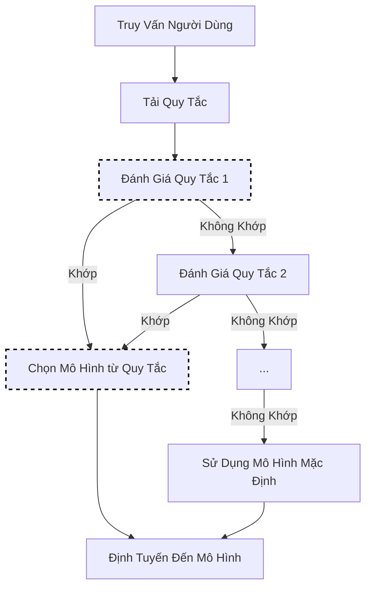

# Lựa Chọn Tĩnh

Lựa chọn tĩnh định tuyến các yêu cầu đến một mô hình cố định dựa trên các quy tắc được xác định trước. Đây là phương pháp lựa chọn đơn giản nhất, lý tưởng cho các nhu cầu định tuyến xác định.

## Luồng Thuật Toán



## Thuật Toán Cơ Bản (Go)

```go
// Select sử dụng khớp dựa trên quy tắc
func (s *StaticSelector) Select(ctx context.Context, selCtx *SelectionContext) (*SelectionResult, error) {
    for _, rule := range s.rules {
        if s.matchesRule(rule, selCtx) {
            return &SelectionResult{
                SelectedModel: rule.Model,
                Method:        MethodStatic,
                Reason:        fmt.Sprintf("khớp quy tắc: %s", rule.Name),
            }, nil
        }
    }

    // Không có quy tắc khớp, sử dụng mặc định
    return &SelectionResult{
        SelectedModel: s.defaultModel,
        Method:        MethodStatic,
        Reason:        "mô hình mặc định (không có quy tắc khớp)",
    }, nil
}

func (s *StaticSelector) matchesRule(rule Rule, selCtx *SelectionContext) bool {
    if rule.Match.Category != "" && selCtx.Category != rule.Match.Category {
        return false
    }
    if len(rule.Match.Keywords) > 0 && !containsAny(selCtx.Query, rule.Match.Keywords) {
        return false
    }
    if rule.Match.MaxTokensGT > 0 && selCtx.MaxTokens <= rule.Match.MaxTokensGT {
        return false
    }
    return true
}
```

## Cách Hoạt Động

Lựa chọn tĩnh sử dụng các quy tắc rõ ràng để khớp các yêu cầu với các mô hình:

1. Đánh giá yêu cầu dựa trên các quy tắc được cấu hình
2. Quy tắc khớp đầu tiên xác định mô hình
3. Nếu không có quy tắc khớp, sử dụng mô hình mặc định

## Cấu Hình

```yaml
decision:
  algorithm:
    type: static
    static:
      default_model: gpt-3.5-turbo
      rules:
        - match:
            category: coding
          model: gpt-4
        - match:
            category: simple
          model: gpt-3.5-turbo
        - match:
            keywords: ["analyze", "complex", "detailed"]
          model: gpt-4
        - match:
            max_tokens_gt: 2000
          model: gpt-4

models:
  - name: gpt-4
    backend: openai
  - name: gpt-3.5-turbo
    backend: openai
```

## Khớp Quy Tắc

### Dựa Trên Danh Mục

```yaml
rules:
  - match:
      category: coding
    model: gpt-4
```

### Dựa Trên Từ Khóa

```yaml
rules:
  - match:
      keywords: ["urgent", "important", "critical"]
    model: gpt-4
```

### Dựa Trên Token

```yaml
rules:
  - match:
      max_tokens_gt: 4000
    model: gpt-4-32k
```

### Điều Kiện Kết Hợp

```yaml
rules:
  - match:
      category: coding
      keywords: ["debug", "fix"]
    model: gpt-4  # Cả hai điều kiện phải khớp
```

## Ưu Tiên Quy Tắc

Các quy tắc được đánh giá theo thứ tự. Đặt các quy tắc cụ thể trước:

```yaml
rules:
  # Quy tắc cụ thể trước
  - match:
      category: coding
      keywords: ["security"]
    model: gpt-4-security-tuned

  # Quy tắc chung thứ hai
  - match:
      category: coding
    model: gpt-4

  # Bắt tất cả cuối cùng (hoặc sử dụng default_model)
  - match: {}
    model: gpt-3.5-turbo
```

## Khi Nào Sử Dụng Lựa Chọn Tĩnh

**Tốt cho:**

- Định tuyến xác định, có thể dự đoán được
- Yêu cầu tuân thủ (dữ liệu nhất định phải sử dụng các mô hình cụ thể)
- Các trường hợp sử dụng đơn giản với phân loại rõ ràng
- Phát triển và kiểm thử

**Xem xét các giải pháp thay thế khi:**

- Các loại truy vấn đa dạng và khó phân loại
- Bạn muốn tối ưu hóa chi phí vs chất lượng động
- Bạn cần hành vi thích ứng dựa trên phản hồi

## Thực Hành Tốt Nhất

1. **Thứ tự quan trọng**: Đặt các quy tắc cụ thể trước những công thức chung
2. **Luôn đặt mặc định**: Đảm bảo `default_model` được cấu hình cho các yêu cầu không khớp
3. **Kiểm thử quy tắc**: Xác minh khớp quy tắc với các truy vấn đại diện
4. **Giữ quy tắc đơn giản**: Các tập quy tắc phức tạp trở nên khó duy trì
