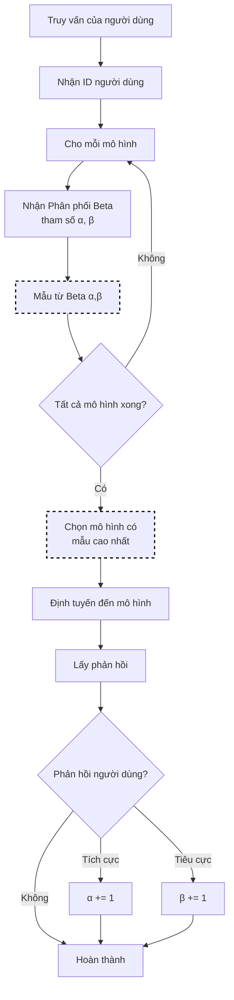

# Lựa Chọn Thompson Sampling

Thompson Sampling là một cách tiếp cận Bayesian để giải quyết sự đánh đổi giữa khám phá và khai thác. Nó tự nhiên cân bằng giữa việc thử các mô hình mới (khám phá) với việc sử dụng các mô hình được biết là tốt (khai thác), được áp dụng cho lựa chọn mô hình LLM như một vấn đề máy trò chơi đa tay.

> **Tham khảo**: [A Tutorial on Thompson Sampling](https://arxiv.org/abs/1707.02038) của Russo, Van Roy, Kazerouni, Osband & Wen. Hướng dẫn toàn diện này bao gồm các nền tảng lý thuyết mà chúng tôi áp dụng ở đây.

## Luồng Thuật toán



## Nền Tảng Toán Học

### Phân Phối Beta

Mỗi mô hình duy trì một phân phối Beta đại diện cho xác suất thành công:

```text
P(θ | α, β) = Beta(α, β)

trong đó:
  α = prior_alpha + successes
  β = prior_beta + failures
  θ = true success probability (unknown)
```

### Quá Trình Lấy Mẫu

Đối với mỗi lựa chọn, lấy mẫu từ phân phối hậu của mỗi mô hình:

```text
θ_i ~ Beta(α_i, β_i)   cho mỗi mô hình i

Chọn mô hình: argmax_i(θ_i)
```

### Cập Nhật Bayes

Sau khi phản hồi, cập nhật phân phối của mô hình được chọn:

```text
Nếu thành công: α' = α + 1
Nếu thất bại: β' = β + 1
```

### Giá Trị Dự Kiến và Phương Sai

```text
E[θ] = α / (α + β)           # Tỷ lệ thành công dự kiến
Var[θ] = αβ / ((α+β)²(α+β+1))  # Không chắc chắn
```

Phương sai cao → khám phá nhiều hơn (mô hình không chắc chắn)
Phương sai thấp → khai thác nhiều hơn (tự tin về mô hình)

## Thuật Toán Cốt Lõi (Go)

```go
// Chọn sử dụng Thompson Sampling
func (s *ThompsonSelector) Select(ctx context.Context, selCtx *SelectionContext) (*SelectionResult, error) {
    var bestModel string
    var bestSample float64 = -1

    userID := s.getUserID(selCtx)

    for _, candidate := range selCtx.CandidateModels {
        alpha, beta := s.getParams(userID, candidate.Model)

        // Mẫu từ phân phối Beta
        sample := s.sampleBeta(alpha, beta)

        if sample > bestSample {
            bestSample = sample
            bestModel = candidate.Model
        }
    }

    return &SelectionResult{
        SelectedModel: bestModel,
        Score:         bestSample,
        Method:        MethodThompson,
    }, nil
}

// UpdateFeedback điều chỉnh các tham số Beta
func (s *ThompsonSelector) UpdateFeedback(userID, model string, success bool) {
    alpha, beta := s.getParams(userID, model)

    if success {
        s.setParams(userID, model, alpha+1, beta)
    } else {
        s.setParams(userID, model, alpha, beta+1)
    }
}
```

## Cách Hoạt Động

1. Mỗi mô hình duy trì một phân phối Beta đại diện cho xác suất thành công của nó
2. Đối với mỗi yêu cầu, lấy mẫu từ phân phối của mỗi mô hình
3. Chọn mô hình có giá trị mẫu cao nhất
4. Cập nhật phân phối dựa trên phản hồi

Cách tiếp cận này tự động khám phá các tùy chọn không chắc chắn trong khi khai thác các tùy chọn được biết là tốt.

## Cấu Hình

```yaml
decision:
  algorithm:
    type: thompson
    thompson:
      prior_alpha: 1.0        # Thành công trước (lạc quan: cao hơn)
      prior_beta: 1.0         # Thất bại trước (bi quan: cao hơn)
      per_user: true          # Cá nhân hóa cho mỗi người dùng
      decay_factor: 0.1       # Phân rã các quan sát cũ
      min_samples: 10         # Mẫu tối thiểu trước khi khai thác

models:
  - name: gpt-4
    backend: openai
  - name: gpt-3.5-turbo
    backend: openai
  - name: claude-3-opus
    backend: anthropic
```

## Tham Số Chính

| Tham số | Mặc định | Mô tả |
|---------|---------|-------|
| `prior_alpha` | 1.0 | Thành công trước; cao hơn = lạc quan hơn |
| `prior_beta` | 1.0 | Thất bại trước; cao hơn = bi quan hơn |
| `per_user` | false | Duy trì phân phối riêng biệt cho mỗi người dùng |
| `decay_factor` | 0.0 | Tỷ lệ decay cho các quan sát cũ (0 = không decay) |
| `min_samples` | 10 | Mẫu tối thiểu trước khi khai thác đầy đủ |

## Cài Đặt Trước

Trước đó (alpha, beta) hình dạng hành vi ban đầu:

| Cài đặt | Hành vi |
|--------|--------|
| (1, 1) | Trước đó thống nhất - khám phá bằng nhau |
| (2, 1) | Lạc quan - giả định các mô hình tốt |
| (1, 2) | Bi quan - giả định các mô hình cần chứng minh |
| (10, 10) | Trước đó tự tin - chậm thay đổi |

## Cá Nhân Hóa Cho Mỗi Người Dùng

Với `per_user: true`, mỗi người dùng nhận phân phối riêng của họ:

```yaml
thompson:
  per_user: true
```

Điều này cho phép hệ thống học tập rằng Người dùng A thích GPT-4 trong khi Người dùng B thích Claude.

## Tích Hợp Phản Hồi

Thompson Sampling cập nhật thông qua API phản hồi:

```bash
# Phản hồi tích cực (thành công)
curl -X POST http://localhost:8080/api/v1/feedback \
  -d '{"request_id": "req-123", "model": "gpt-4", "rating": 1}'

# Phản hồi tiêu cực (thất bại)
curl -X POST http://localhost:8080/api/v1/feedback \
  -d '{"request_id": "req-456", "model": "gpt-4", "rating": -1}'
```

## Các Thực Hành Tốt Nhất

1. **Bắt đầu với tiền đồng nhất**: (1, 1) trừ khi bạn có kiến thức trước
2. **Kích hoạt cá nhân hóa cho mỗi người dùng**: Tìm hiểu sở thích cá nhân
3. **Sử dụng decay cho môi trường không cố định**: Khi chất lượng mô hình thay đổi
4. **Đặt min_samples thích hợp**: Quá thấp = khai thác sớm
