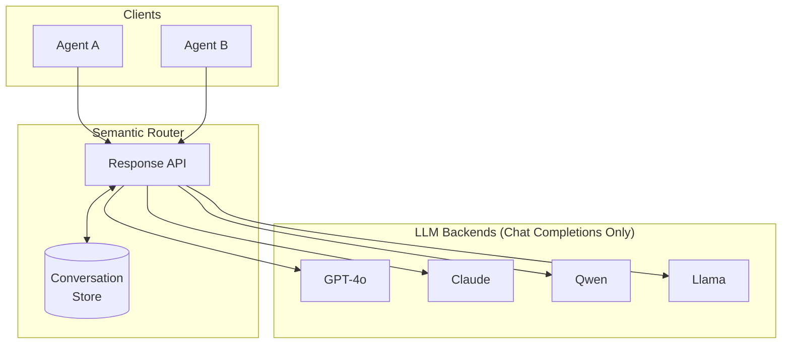
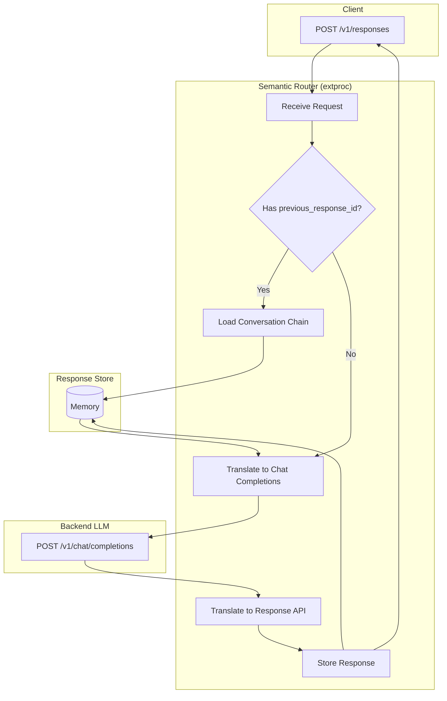

# Các Cuộc trò chuyện Nhiều lượt

Router Memory cho phép các cuộc trò chuyện trạng thái được duy trì thông qua [OpenAI Response API](https://platform.openai.com/docs/api-reference/responses), hỗ trợ xâu chuỗi cuộc trò chuyện với `previous_response_id`.

## Tổng quan

Semantic Router hoạt động như **bộ não thống nhất** cho nhiều phần mềm nền tảng LLM chỉ hỗ trợ Chat Completions API. Nó cung cấp:

- **Cuộc trò chuyện Trạng thái Giữa các Mô hình**: Duy trì lịch sử trò chuyện trên các mô hình khác nhau
- **API Phản hồi Thống nhất**: Giao diện API đơn lẻ bất kể mô hình phần mềm nền tảng
- **Tự động Dịch Minh bạch**: Chuyển đổi tự động giữa Response API và Chat Completions



Với Router Memory, bạn có thể bắt đầu một cuộc trò chuyện với một mô hình và tiếp tục nó với một mô hình khác - lịch sử trò chuyện được lưu trữ trong router, không phải trong bất kỳ phần mềm nền tảng nào.

## Luồng Yêu cầu



## Các Điểm cuối

| Điểm cuối | Phương pháp | Mô tả |
|----------|--------|-------------|
| `/v1/responses` | POST | Tạo một phản hồi mới |
| `/v1/responses/{id}` | GET | Truy xuất một phản hồi được lưu trữ |
| `/v1/responses/{id}` | DELETE | Xóa một phản hồi được lưu trữ |
| `/v1/responses/{id}/input_items` | GET | Liệt kê các mục nhập cho một phản hồi |

## Cấu hình

```yaml
response_api:
  enabled: true
  store_backend: "memory"   # Currently only "memory" is supported
  ttl_seconds: 86400        # Default: 30 days
  max_responses: 1000
```

## Cách sử dụng

### 1. Tạo Phản hồi

```bash
curl -X POST http://localhost:8801/v1/responses \
  -H "Content-Type: application/json" \
  -d '{
    "model": "openai/gpt-oss-120b",
    "input": "Tell me a joke.",
    "instructions": "Remember my name is Xunzhuo. Then I will ask you!",
    "temperature": 0.7,
    "max_output_tokens": 100
  }'
```

Phản hồi:

```json
{
  "id": "resp_7cb437001e1ad5b84b6dd8ef",
  "object": "response",
  "status": "completed",
  "output": [{
    "type": "message",
    "role": "assistant",
    "content": [{"type": "output_text", "text": "Sure thing, Xunzhuo! Why don't scientists trust atoms? Because they make up everything! 😄"}]
  }],
  "usage": {"input_tokens": 94, "output_tokens": 75, "total_tokens": 169}
}
```

### 2. Tiếp tục Cuộc trò chuyện

Sử dụng `previous_response_id` để xâu chuỗi cuộc trò chuyện:

```bash
curl -X POST http://localhost:8801/v1/responses \
  -H "Content-Type: application/json" \
  -d '{
    "model": "openai/gpt-oss-120b",
    "input": "What is my name?",
    "previous_response_id": "resp_7cb437001e1ad5b84b6dd8ef",
    "max_output_tokens": 100
  }'
```

Phản hồi:

```json
{
  "id": "resp_ec2822df62e390dcb87aa61d",
  "status": "completed",
  "output": [{
    "type": "message",
    "role": "assistant",
    "content": [{"type": "output_text", "text": "Your name is Xunzhuo."}]
  }],
  "previous_response_id": "resp_7cb437001e1ad5b84b6dd8ef"
}
```

### 3. Lấy Phản hồi

```bash
curl http://localhost:8801/v1/responses/resp_7cb437001e1ad5b84b6dd8ef
```

### 4. Liệt kê Các Mục Nhập

```bash
curl http://localhost:8801/v1/responses/resp_7cb437001e1ad5b84b6dd8ef/input_items
```

Phản hồi:

```json
{
  "object": "list",
  "data": [{
    "type": "message",
    "role": "system",
    "content": [{"type": "input_text", "text": "Remember my name is Xunzhuo."}]
  }],
  "has_more": false
}
```

### 5. Xóa Phản hồi

```bash
curl -X DELETE http://localhost:8801/v1/responses/resp_7cb437001e1ad5b84b6dd8ef
```

## Dịch API

| Response API | Chat Completions |
|--------------|------------------|
| `input` | `messages[].content` (role: user) |
| `instructions` | `messages[0]` (role: system) |
| `previous_response_id` | Expanded to full `messages` array |
| `max_output_tokens` | `max_tokens` |

## Tham chiếu

- [OpenAI Response API](https://platform.openai.com/docs/api-reference/responses)
