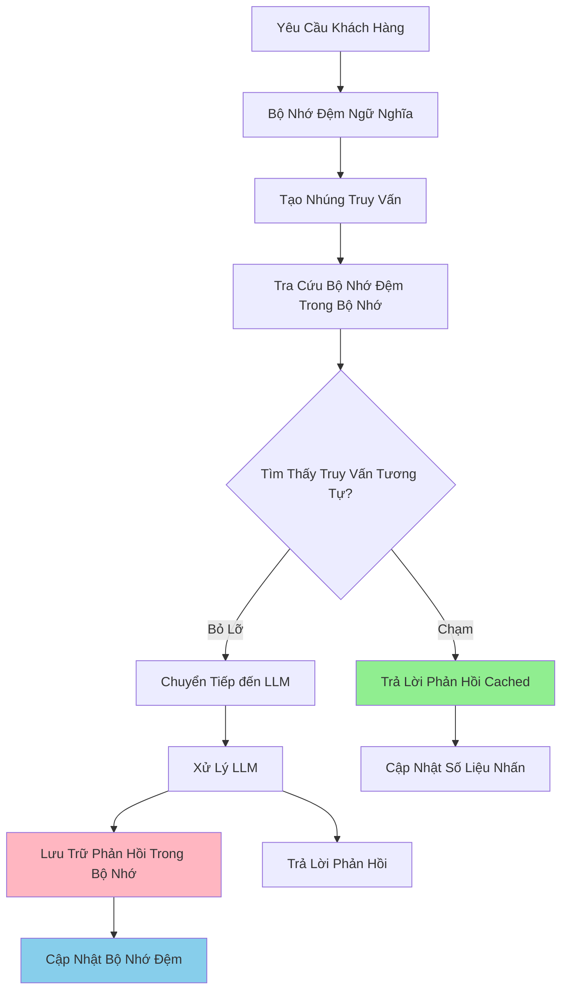

# Bộ Nhớ Đệm Ngữ Nghĩa Trong Bộ Nhớ

Bộ nhớ đệm backend trong bộ nhớ lưu trữ các nhúng ngữ nghĩa và các phản hồi được lưu trong bộ nhớ trực tiếp để bộ nhớ đệm cục bộ nhanh.

## Tổng Quan

Bộ nhớ đệm trong bộ nhớ lưu trữ tất cả dữ liệu bộ nhớ đệm trong bộ nhớ của ứng dụng, cung cấp quyền truy cập độ trễ thấp mà không có sự phụ thuộc bên ngoài.

## Kiến Trúc



## Cách Hoạt Động

### Đường Dẫn Viết

Khi lưu trữ phản hồi:

1. Tạo nhúng cho truy vấn bằng mô hình nhúng được cấu hình
2. Lưu trữ nhúng và phản hồi trong bộ nhớ
3. Áp dụng TTL nếu được cấu hình
4. Loại bỏ các mục cũ nhất/ít sử dụng nhất nếu đạt giới hạn max_entries

### Đường Dẫn Đọc

Khi tìm kiếm phản hồi được lưu trong bộ nhớ đệm:

1. Tạo nhúng cho truy vấn đến
2. Tìm kiếm trong bộ nhớ đệm để tìm các nhúng tương tự
3. Nếu tương đồng vượt quá ngưỡng, trả lại phản hồi được lưu (chạm bộ nhớ đệm)
4. Ngoài ra, chuyển tiếp đến LLM và lưu trữ phản hồi mới (bỏ lỡ bộ nhớ đệm)

### Phương Pháp Tìm Kiếm

Bộ nhớ đệm hỗ trợ hai phương pháp tìm kiếm:

- **Tìm Kiếm Tuyến Tính**: So sánh nhúng truy vấn dựa trên tất cả các nhúng được lưu trong bộ nhớ đệm
- **Chỉ Mục HNSW**: Sử dụng cấu trúc biểu đồ phân cấp để tìm kiếm hàng xóm gần đúng nhanh hơn

## Cấu Hình

### Cấu Hình Cơ Bản

```yaml
# config/config.yaml
semantic_cache:
  enabled: true
  backend_type: "memory"
  similarity_threshold: 0.8       # Ngưỡng mặc định toàn cầu
  max_entries: 1000
  ttl_seconds: 3600
  eviction_policy: "fifo"
```

### Cấu Hình Với HNSW

```yaml
semantic_cache:
  enabled: true
  backend_type: "memory"
  similarity_threshold: 0.8
  max_entries: 1000
  ttl_seconds: 3600
  eviction_policy: "fifo"
  # Chỉ mục HNSW để tìm kiếm nhanh hơn
  use_hnsw: true
  hnsw_m: 16
  hnsw_ef_construction: 200
```

## Cài Đặt và Kiểm Thử

### Bật Bộ Nhớ Đệm Trong Bộ Nhớ

Cập nhật tệp cấu hình của bạn:

```bash
# Chỉnh sửa config/config.yaml
cat >> config/config.yaml << EOF
semantic_cache:
  enabled: true
  backend_type: "memory"
  similarity_threshold: 0.85
  max_entries: 1000
  ttl_seconds: 3600
EOF
```

### Bắt Đầu Router

```bash
# Bắt đầu bộ định tuyến ngữ nghĩa
make run-router

# Hoặc chạy trực tiếp
./bin/router --config config/config.yaml
```

### Kiểm Thử Chức Năng Bộ Nhớ Đệm

Gửi các yêu cầu để xác minh hành vi bộ nhớ đệm:

```bash
# Yêu cầu đầu tiên (bỏ lỡ bộ nhớ đệm)
curl -X POST http://localhost:8080/v1/chat/completions \
  -H "Content-Type: application/json" \
  -d '{
    "model": "MoM",
    "messages": [{"role": "user", "content": "Máy học là gì?"}]
  }'

# Yêu cầu giống hệt (nhấn bộ nhớ đệm)
curl -X POST http://localhost:8080/v1/chat/completions \
  -H "Content-Type: application/json" \
  -d '{
    "model": "MoM",
    "messages": [{"role": "user", "content": "Máy học là gì?"}]
  }'

# Yêu cầu tương tự (nhấn bộ nhớ đệm ngữ nghĩa)
curl -X POST http://localhost:8080/v1/chat/completions \
  -H "Content-Type: application/json" \
  -d '{
    "model": "MoM",
    "messages": [{"role": "user", "content": "Giải thích các khái niệm máy học"}]
  }'
```

## Đặc Điểm

### Lưu Trữ

- Dữ liệu được lưu trữ trong bộ nhớ ứng dụng
- Bộ nhớ đệm được xóa khi ứng dụng khởi động lại
- Bị giới hạn bởi bộ nhớ hệ thống khả dụng

### Mô Hình Truy Cập

- Truy cập bộ nhớ trực tiếp mà không có chi phí mạng
- Không cần phụ thuộc bên ngoài

### Chính Sách Loại Bỏ

- **FIFO**: First In, First Out - loại bỏ các mục cũ nhất
- **LRU**: Least Recently Used - loại bỏ các mục được truy cập gần đây nhất
- **LFU**: Least Frequently Used - loại bỏ các mục được truy cập ít nhất

### Quản Lý TTL

- Các mục có thể có thời gian sống (TTL)
- Các mục hết hạn được loại bỏ trong quá trình làm sạch

## Các Bước Tiếp Theo

- **[Bộ Nhớ Đệm Hybrid](./hybrid-cache.md)** - Tìm hiểu về bộ nhớ đệm hybrid HNSW + Milvus
- **[Bộ Nhớ Đệm Milvus](./milvus-cache.md)** - Tìm hiểu về bộ nhớ đệm cơ sở dữ liệu vectơ bền bỉ
- **[Khả Năng Quan Sát](../observability/metrics.md)** - Theo dõi hiệu suất bộ nhớ đệm
