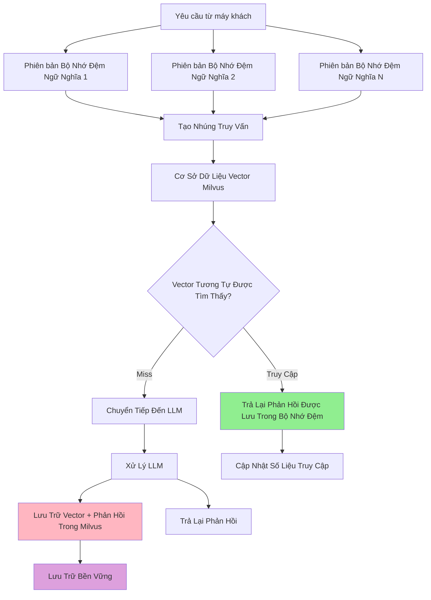

# Bộ Nhớ Đệm Ngữ Nghĩa Milvus

Phần phụ trợ bộ nhớ đệm Milvus cung cấp bộ nhớ đệm ngữ nghĩa phân tán, bền vững bằng cách sử dụng cơ sở dữ liệu vector Milvus. Đây là giải pháp được khuyến nghị cho các triển khai sản xuất yêu cầu tính sẵn sàng cao, khả năng mở rộng và tính bền vững của dữ liệu.

## Tổng Quan

Bộ nhớ đệm Milvus lý tưởng cho:

- **Môi trường sản xuất** có yêu cầu về tính sẵn sàng cao
- **Triển khai phân tán** trên nhiều phiên bản
- **Ứng dụng quy mô lớn** với hàng triệu truy vấn được lưu trong bộ nhớ đệm
- **Yêu cầu lưu trữ bền vững** nơi bộ nhớ đệm tồn tại qua nhiều lần khởi động lại
- **Các hoạt động vector nâng cao** và tối ưu hóa tìm kiếm tương tự

## Kiến Trúc



## Cấu Hình

### Cấu Hình Phụ Trợ Milvus

Cấu hình trong `config/semantic-cache/milvus.yaml`:

```yaml
# config/semantic-cache/milvus.yaml
connection:
  host: "localhost"
  port: 19530
  auth:
    enabled: false
    username: ""
    password: ""
  tls:
    enabled: false

collection:
  name: "semantic_cache"
  dimension: 384  # Phải khớp với chiều mô hình nhúng
  index_type: "IVF_FLAT"
  metric_type: "COSINE"
  nlist: 1024

performance:
  search_params:
    nprobe: 10
  insert_batch_size: 1000
  search_batch_size: 100

development:
  drop_collection_on_startup: false
  auto_create_collection: true
  log_level: "info"
```

## Thiết Lập và Triển Khai

Bắt Đầu Dịch Vụ Milvus:

```bash
# Sử dụng Docker
make start-milvus

# Xác minh Milvus đang chạy
curl http://localhost:19530/health
```

### 2. Cấu Hình Bộ Định Tuyến Ngữ Nghĩa

Cấu Hình Milvus Cơ Bản:

- Đặt `backend_type: "milvus"` trong `config/config.yaml`
- Đặt `backend_config_path: "config/semantic-cache/milvus.yaml"` trong `config/config.yaml`

```yaml
# config/config.yaml
semantic_cache:
  enabled: true
  backend_type: "milvus"
  backend_config_path: "config/semantic-cache/milvus.yaml"
  similarity_threshold: 0.8
  ttl_seconds: 7200
```

### Cấu Hình Cấp Quyết Định (Dựa Trên Plugin)

Bạn cũng có thể cấu hình bộ nhớ đệm Milvus ở cấp quyết định bằng các plugin:

```yaml
signals:
  domains:
    - name: "math"
      description: "Truy vấn toán học"
      mmlu_categories: ["math"]

decisions:
  - name: math_route
    description: "Định tuyến truy vấn toán học với bộ nhớ đệm nghiêm ngặt"
    priority: 100
    rules:
      operator: "AND"
      conditions:
        - type: "domain"
          name: "math"
    modelRefs:
      - model: "openai/gpt-oss-120b"
        use_reasoning: true
    plugins:
      - type: "semantic-cache"
        configuration:
          enabled: true
          similarity_threshold: 0.95  # Rất nghiêm ngặt cho độ chính xác toán học
```

Chạy Bộ Định Tuyến Ngữ Nghĩa:

```bash
# Máy chủ bắt đầu
make run-router
```

Chạy EnvoyProxy:

```bash
# Bắt đầu proxy Envoy
make run-envoy
```

### 4. Kiểm Tra Bộ Nhớ Đệm Milvus

```bash
# Gửi các yêu cầu giống hệt nhau để xem truy cập bộ nhớ đệm
curl -X POST http://localhost:8080/v1/chat/completions \
  -H "Content-Type: application/json" \
  -d '{
    "model": "MoM",
    "messages": [{"role": "user", "content": "Machine learning là gì?"}]
  }'

# Gửi yêu cầu tương tự (nên truy cập bộ nhớ đệm do tương tự ngữ nghĩa)
curl -X POST http://localhost:8080/v1/chat/completions \
  -H "Content-Type: application/json" \
  -d '{
    "model": "MoM",
    "messages": [{"role": "user", "content": "Giải thích machine learning"}]
  }'
```

## Các Bước Tiếp Theo

- **[In-Memory Cache](./in-memory-cache.md)** - So sánh với bộ nhớ đệm trong bộ nhớ
- **[Khả Năng Quan Sát được](../observability/metrics.md)** - Giám sát hiệu suất Milvus
- **[Tích Hợp Kubernetes](../../installation/milvus.md)** - Triển khai Milvus trên Kubernetes
