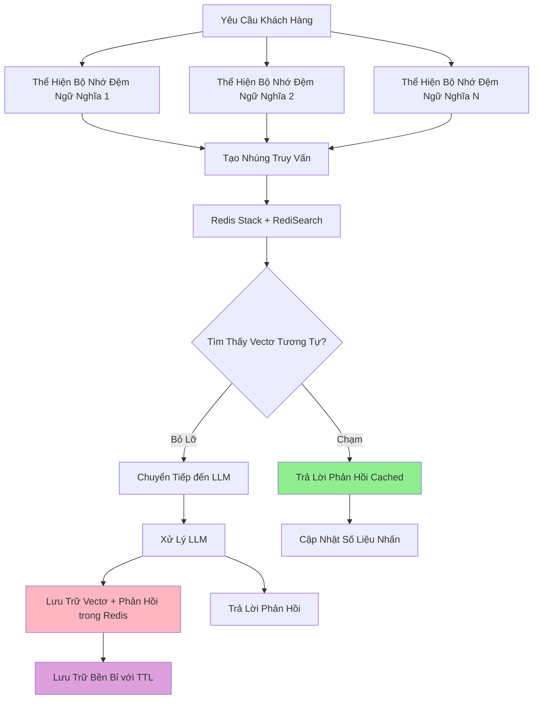

# Bộ Nhớ Đệm Ngữ Nghĩa Redis

Bộ nhớ đệm Redis cung cấp bộ nhớ đệm ngữ nghĩa có hiệu suất cao, lâu dài bằng Redis Stack với RediSearch. Giải pháp này cung cấp hiệu suất tuyệt vời với độ phức tạp hoạt động thấp hơn so với các cơ sở dữ liệu vectơ chuyên biệt.

## Tổng Quan

Bộ nhớ đệm Redis lý tưởng cho:

- **Môi trường sản xuất** yêu cầu thời gian phản hồi nhanh
- **Triển khai redis đơn lẻ hoặc được phân cụm**
- **Ứng dụng quy mô vừa đến lớn** với sử dụng bộ nhớ hiệu quả
- **Lưu trữ bền bỉ** với hết hạn TTL tùy chọn
- **Vận hành được đơn giản hóa** bằng công cụ Redis quen thuộc

## Kiến Trúc



## Cấu Hình

### Cấu Hình Backend Redis

Cấu hình trong `config/semantic-cache/redis.yaml`:

```yaml
# config/semantic-cache/redis.yaml
connection:
  address: "localhost:6379"
  password: ""
  db: 0
  pool_size: 10
  max_retries: 3
  dial_timeout_ms: 5000
  read_timeout_ms: 3000
  write_timeout_ms: 3000
  tls:
    enabled: false

index:
  name: "semantic_cache_idx"
  prefix: "doc:"
  vector_field:
    name: "embedding"
    dimension: 384  # Phải khớp với chiều mô hình nhúng
    algorithm: "HNSW"
    metric_type: "COSINE"
    hnsw:
      m: 16
      ef_construction: 200
      ef_runtime: 10

search:
  top_k: 5

development:
  drop_index_on_startup: false
  log_level: "info"
```

## Cài Đặt và Triển Khai

Bắt đầu Redis Stack:

```bash
# Sử dụng Docker
make start-redis

# Xác minh Redis đang chạy
docker exec redis-semantic-cache redis-cli PING
```

### 2. Cấu Hình Bộ Định Tuyến Ngữ Nghĩa

Cấu Hình Redis Cơ Bản:

- Đặt `backend_type: "redis"` trong `config/config.yaml`
- Đặt `backend_config_path: "config/semantic-cache/redis.yaml"` trong `config/config.yaml`

```yaml
# config/config.yaml
semantic_cache:
  enabled: true
  backend_type: "redis"
  backend_config_path: "config/semantic-cache/redis.yaml"
  similarity_threshold: 0.8
  ttl_seconds: 3600
```

### Cấu Hình Cấp Quyết Định (Dựa Trên Plugin)

Bạn cũng có thể cấu hình bộ nhớ đệm Redis ở cấp quyết định bằng các plugin:

```yaml
signals:
  domains:
    - name: "math"
      description: "Truy vấn toán học"
      mmlu_categories: ["math"]

decisions:
  - name: math_route
    description: "Định tuyến truy vấn toán học với bộ nhớ đệm nghiêm ngặt"
    priority: 100
    rules:
      operator: "AND"
      conditions:
        - type: "domain"
          name: "math"
    modelRefs:
      - model: "openai/gpt-oss-120b"
        use_reasoning: true
    plugins:
      - type: "semantic-cache"
        configuration:
          enabled: true
          similarity_threshold: 0.95  # Rất nghiêm ngặt cho độ chính xác toán học
```

Chạy Bộ Định Tuyến Ngữ Nghĩa:

```bash
# Bắt đầu router
make run-router
```

Chạy EnvoyProxy:

```bash
# Bắt đầu proxy Envoy
make run-envoy
```

### 4. Kiểm Thử Bộ Nhớ Đệm Redis

```bash
# Gửi các yêu cầu giống hệt nhau để xem các lần nhấn bộ nhớ đệm
curl -X POST http://localhost:8080/v1/chat/completions \
  -H "Content-Type: application/json" \
  -d '{
    "model": "MoM",
    "messages": [{"role": "user", "content": "Máy học là gì?"}]
  }'

# Gửi yêu cầu tương tự (nên chạm bộ nhớ đệm do tương đồng ngữ nghĩa)
curl -X POST http://localhost:8080/v1/chat/completions \
  -H "Content-Type: application/json" \
  -d '{
    "model": "MoM",
    "messages": [{"role": "user", "content": "Giải thích máy học"}]
  }'
```

## Các Bước Tiếp Theo

- **[Bộ Nhớ Đệm Milvus](./milvus-cache.md)** - So sánh với cơ sở dữ liệu vectơ Milvus
- **[Bộ Nhớ Đệm Trong Bộ Nhớ](./in-memory-cache.md)** - So sánh với bộ nhớ đệm trong bộ nhớ
- **[Khả Năng Quan Sát](../observability/metrics.md)** - Theo dõi hiệu suất Redis
